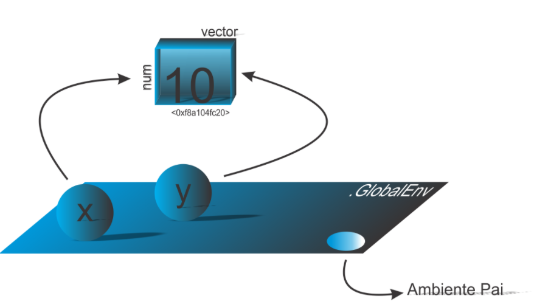

# Objetos

Definimos um objeto como uma entidade no ambiente R com características internas contendo informações necessárias para interpretar sua estrutura e conteúdo. Essas características são chamadas de **atributos**. Vamos entender o termo estrutura como a disposição de como está o seu conteúdo. Por exemplo, a estrutura de um objeto mais simples no R é um **vetor atômico**, pois os elementos contidos nele, apresenta o mesmo **modo**, um tipo de atributo. Falaremos nisso, mais à frente. De forma didática, adaptaremos a representação dos objetos no formato de diagrama. Vejamos a seguinte linha de comando:


```{r primeiro_codigo, echo=TRUE, , prompt=TRUE}
x <- 10
```

Todo mundo que tem uma certa noção sobre a linguagem **R** afirmaria: “criei um objeto x que recebe o valor 10”. Para Wickham (2019) essa afirmação é imprecisa e pode levar um entendimento equivocado sobre o que acontece de fato. Para o mesmo autor, o correto é afirmar que o objeto 10 está se ligando a um nome. E de fato, o objeto não tem um nome, mas o nome tem um objeto. O símbolo que associa um objeto a um nome é o de atribuição, <-, isto é, a junção do símbolo desigualdade menor e o símbolo de menos. Para ver qual objeto associado ao nome, o usuário precisa apenas digitar o nome no console e apertar a tecla *ENTER*.


Representaremos em termos de diagrama, um nome se ligando a um objeto, na Figura \@ref(fig:objx).

```{r objx, fig.cap = "Dizemos que o nome `'x'` se liga ao objeto do tipo (estrutura) vetor.", fig.height= 6, fig.width=9, fig.align='center'}

```

O identificador na memória ativa desse objeto pode ser obtida por:

```{r id_primeiro_codigo, echo=TRUE, eval=FALSE, prompt=TRUE}
lobstr::obj_addr(x)
# [1] "0xf8a104fc20"
```


O diagrama explica que o nome criado x se associou com um objeto do **tipo** (estrutura) vetor (vector) e **modo** numérico (numeric)1 , cuja identificação na memória ativa do seu computador foi <0xf8a104fc20>. É claro que para cada vez que o usuário abri o ambiente **R** e executar novamente esse comando, ou repeti o comando, esse identificador irá alterar.

Essa outra representação, Código R ??, ficará mais claro para a afirmação feita anteriormente, no segundo diagrama, Figura \@ref(fig:objxy), que representa a ligação do nome y ao mesmo objeto. Os termos nos diagramas, serão usados de acordo com a sintaxe da linguagem com os termos em inglês para melhor compreensão e fixação dos termos utilizados em R , uma vez que os termos na linguagem são baseados nesse idioma.

```{r segundo_codigo, echo=TRUE, eval=FALSE, prompt=TRUE}
y <- x
lobstr::obj_addr(y)
# [1] "0xf8a104fc20"
```

Observem que não houve a criação de um outro objeto, mas apenas a ligação de mais um nome ao objeto existente, pois o identificador na memória ativa para o objeto não alterou, é o mesmo. Logo, não temos um outro objeto, mais dois nomes que se ligam ao mesmo objeto.

```{r objxy, fig.cap = "Dizemos que o nome `'x'` e '`y`' se ligam ao objeto do tipo (estrutura) vetor.", fig.height= 6, fig.width=9, fig.align='center'}

```


Mais especificamente, acrescentamos um outro diagrama, Figura \@ref(fig:objxyglobalenv), mostrando a representação do ambiente global (.GlobalEnv, nome associado ao objeto que representa o ambiente global).

```{r objxyglobalenv, fig.cap = "Dizemos que o nome `'x'` e `'y'` se ligam ao objeto do tipo (estrutura) vetor e essa ligação fica armazenada no ambiente global.", out.width="80%", fig.align='center'}

```

De todo modo, deixaremos para o Volume II, uma abordagem mais profunda sobre o assunto. O símbolo de atribuição poderá ser representado na direção da esquerda para à direita ou vice-versa, isto é,

```{r terceiro_codigo, echo=TRUE, prompt=TRUE}
x <- 10
10 -> x
```

Essas duas linhas de comando anteriores podem ter passado despercebidas pelo leitor em uma situação. Se na segunda linha tivéssemos alterado o valor do objeto de 10 para 30, por exemplo, a associação de x seria ao objeto 30. Isso significa que se o nome já existe, ele será apagado da memória ativa do computador e associado ao novo objeto 2. Veja,

```{r quarto_codigo, echo=TRUE, eval=FALSE, prompt=TRUE}
lobstr::obj_addr(x)
# [1] "0xf8a104fc20"
x <- 30
lobstr::obj_addr(x)
# [1] "0x42db6dbb50"
```
Uma outra forma menos convencional é usar a função assign(), isto é,

```{r assign, echo=TRUE, }
assign("m", 15)
m
```

Ao invés do símbolo de atribuição, muitos usuários utilizam o símbolo da igualdade “=” para associarmos nomes aos objetos, que o ambiente **R** compreenderá. Contudo, discutiremos mas adiante, Capítulo ??, que o uso da igualdade deverá em **R** ser usado apenas para a utilização em argumentos de uma função.

Quando desejamos executar mais de uma linha de comando por vez, separamos estas pelo símbolo “;”, isto é,

```{r, echo=TRUE, }
x <- 10; w <- 15; x; w
```

Neste caso, executamos quatro comandos em uma linha. Associamos dois nomes a dois objetos e imprimimos os seus valores.

Por questão de comodidade, iremos a partir de agora, sempre nos referir a um objeto pelo nome associado a ele, para não está sempre se expressando como “um nome associado a um objeto”. Mas que fique claro a discussão realizada anteriormente sobre esses conceitos.

Nesse momento, nos limitaremos a falar sobre objetos que armazenam dados, do tipo caracteres,
números e operadores lógicos (TRUE/FALSE).

## Atributos

Todos os objetos, terão pelo menos dois tipos de atributos, chamados de atributos intrínsecos. Os demais atributos, quando existem, podem ser verificados pela função attributes(). A ideia dos atributos pode ser pensada como metadados, isto é, um conjunto de informações que caracterizam o objeto.

Diremos também que todos os objetos **R** tem uma classe, e por meio dessas classes, determinadas funções podem ter comportamento diferente a objetos com classes diferentes. Agora, devemos deixar claro essa informação, apesar do R seguir o princípio do objeto, nem tudo é orientado a objetos, como por exemplo, observamos na linguagens C++ e Java. Deixemos esse tópico para discorrer no Volume II.

A forma de se verificar a classe de um objeto é pela função class(). Contudo, os objetos internos do **R** (base), quando solicitado sua classe pela função class(), acabam retornando, algumas vezes, resultados equivocados. Uma alternativa é utilizar a função sloop::s3_class() do pacote **sloop**.Isso também será discutido no Volume II.

Devemos nos atentar a uma questão: **existe um atributo também chamado classe** (class), e nem todos os objetos necessariamente tem esse atributo, apenas aqueles orientados a objetos, como é o caso do objeto com atributo classe. Por exemplo, é devido a classe factor no objeto criado pela função factor() que apesar do seu resultado ser numérico, este não se comporta como numérico. Isto significa que o atributo classe muda o comportamento de como funções veem esse objeto. Entretanto, mesmo os objetos que não apresentam esse atributo, quando pedimos pela chamada class() desse referido objeto, haverá o retorno do que chamamos de **classe implícita**, que nada mais é do que a tipagem do objeto baseado no atributo modo (mode() ou typeof()). A Classe implícita não é definida pelo atributo class, mas pela tipagem do objeto. Isso também será abordado no Volume II.

Para verificarmos se tal objeto tem o atributo class, usamos a função attributes(). Quando este atributo existe, ele é coincidente com o resultado obtido também pela função class().

O tipo da classe implícita pode ser *numeric*, *logical*, *character*, *list*, *matrix*, *array*. Outros objetos apresentam classes definidas pelo atributo class, como factor, data.frame, dentre outros.

Para remover o efeito do atributo class, usamos a função unclass() para tal.

Por exemplo, quando criamos um objeto da classe data.frame, vejamos o que acontece quando removemos esse atributo no Código R 5.2.

```{r, echo=TRUE, }
# Criamos um objeto de classe 'data.frame'
dados <- data.frame(a = 1:3, b = LETTERS[1:3])
# Imprimindo na tela
dados
# Verificando sua classe
class(dados)
# Verificando o efeito do objeto 'dados',
# sem o efeito da classe
dados2 <- unclass(dados); dados2
# Qual a classe desse objeto sem o efeito da
# classe 'data.frame'
class(dados2)
```

Observe que sem o atributo *class= 'data.frame'*, o objeto tem classe list. Isto significa que, o objeto tem uma estrutura em forma de list, mas se comporta como um *data.frame*, que se apresenta como mostrado anteriormente. 

Veremos no Volume II como criar atributos, classes, e mostrar que não conseguiremos mostrar todos os tipos de classes, pois a todo momento se cria classes em objetos R no desenvolvimento de pacotes.


### Atributos intrínsecos

Todos os objetos tem dois atributos intrínsecos: o **modo** e **comprimento**. O modo representa a natureza dos elementos objetos. Para o caso dos vetores atômicos, o **modo** dos vetores podem ser cinco, numérico (*numeric*), lógico (*logic*), caractere 3 (*character*), complexo (*complex*) ou bruto (*raw*). Este último, não daremos evidência para esse momento, lembrando que essa tipagem está relacionada alinguagem S. O **comprimento** mede a quantidade de elementos no objeto. Para determinarmos o **modo** de um objeto, usamos a função *mode()*. Vejamos alguns exemplos pelo Código R 5.3.

```{r echo=TRUE, prompt=TRUE}
# Objeto modo caractere
x <- "Ben"; mode(x)
# Objeto modo numerico
y <- 10L; mode(y)
# Objeto modo numerico
y2 <- 10; mode(y2)
# Objeto modo logico
z <- TRUE; mode(z)
# Objeto modo complexo
w <- 1i; mode(w)
```

Contudo, essa função *mode()* se baseou nos atributos baseados na linguagem S. Temos uma outra função para verificarmos o **modo** do objeto que é por typeof(). O atributo **modo** retornado de um objeto para esta última função, está relacionado a tipagem da linguagem C, Código R 5.4, uma vez que boa parte das rotinas no **R** está nessa linguagem, principalmente as funções do pacote **base**. Existem 24 tipos que serão detalhados no Volume II.


```{r echo=TRUE, prompt=TRUE}
# Objeto modo caractere
x <- "Ben"; typeof(x)
# Objeto modo numerico (Inteiro)
y <- 10L; typeof(y) 
# Objeto modo numerico (Real)
y2 <- 10; typeof(y2)
# Objeto modo logico
z <- TRUE; typeof(z)
# Objeto modo complexo
w <- 1i; typeof(w)
```
Observamos que apesar de alguns vetores serem vazios, estes ainda tem um modo, observe nas seguintes linhas de comando, no Código R 5.5.


```{r echo=TRUE, prompt=TRUE}
# Vetor numérico vazio de comprimento 1
numeric(0)
# Verificando o seu modo
mode(numeric(0))
typeof(numeric(0))
# Vetor caractere vazio de comprimento 1
character(0)
# Verificando o seu modo
mode(character(0))
typeof(character(0))
```

A diferença existente nos objetos $y$ e $y^2$ para as funções *mode()* e *typeof()* se referem apenas
como o **R** armazena essas informações na memória do computador. Podemos perguntar ao **R** se
dois números são iguais, assim:

```{r echo=TRUE, prompt=TRUE}
# 10 eh igual a 10L ?
10 == 10L
```

Veja que o resultado é *TRUE*, isto é, sim eles são iguais. Agora, veja a próxima linha de comando:

```{r echo=TRUE, prompt=TRUE}
# 10 eh identico a 10L ?
identical(10, 10L)
```

O retorno agora foi *FALSE*, que significa que o armazenamento dessas informações não são iguais. Posteriormente, entenderemos no que isso reflete no código do usuário, uma vez que um código escrito pode apresentar uma perda de desempenho simplesmente pela não necessidade de determinados objetos serem copiados.

O termo *double* retornado pela função *typeof()* significa dupla precisão na linguagem de programação, que acaba tenho uma exigência de mais memória do que o objeto de modo integer. Esses termos são utilizados na linguagem C. Já a linguagem S não os diferencia, utiliza tudo como *numeric*.

Aqui vale um destaque para o termo numérico, que no **R** podem ter três significados:

- Pode significar um número real, isto é, para a computação um número de dupla precisão (*numeric* e *double* seriam iguais nesse aspecto), Código R 5.6;

```{r echo=TRUE, prompt=TRUE}
# Criacao de dois objetos de modo numerico
a <- numeric(1); b <- double(1)
# Verificando o modo
mode(a); mode(b)
# Verificando se 'a' e 'b' sao identificos
identical(a, b)
```

- nos sistemas S3 e S4 (orientação a objetos), o termo numérico é usado como atalho para o modo integer ou double. Esse ponto veremos Volume II. Contudo, vejamos o Código R 5.7;

```{r echo=TRUE, prompt=TRUE}
sloop::s3_class(1)
sloop::s3_class(1L)
```

- Pode ser utilizado (*is.numeric()*) para verificar se determinados objetos tem o modo numé- rico. Por exemplo, temos um objeto de classe factor que é importante para a área da estatística experimental, representando os níveis de um fator em um experimento. Os elementos desse objeto pode ser número ou caracteres, mas serão representados como sempre por números. Entretanto, não se comportam como numérico, Código R 5.8;

```{r echo=TRUE, prompt=TRUE}
# Criando um objeto de atributo classe 'factor':
fator <- factor("a"); fator
# O atributo classe muda a forma dos elementos. Veja quando retiramos o atributo 
# classe 'factor', o objeto retorna o valor 1
unclass(fator)
# Para confirmar essa afirmacao anterior, vejamos o modo
mode(fator)
typeof(fator)
# Apesar do resultado retornar 1, veja que ele nao se comporta como numerico
is.numeric(fator)
is.integer(fator)
```

A Tabela 5.1 a seguir, mostra o retorno dos seis principais modos de um objeto do tipo (estrutura) de vetores atômicos (Os modos apresentados baseiam-se apenas quanto a característica dos dados do objeto. É claro que um objeto não armazena apenas dados. Existem outras naturezas, que serão omitidas nesse momento).

typeof   | mode
:---------: | :------:
logical | logical
integer | numeric
double | numeric
complex | complex
character | character
raw | raw


O **comprimento** do objeto é informado pela função lenght(), do qual a representação em diagrama informa esse atributo. Vejamos as linhas de comando no Código R 5.9.

```{r echo=TRUE, prompt=TRUE}
# Vetor de comprimento 5
v1 <- 1:5
# Vetor de comprimento 3
v2 <- c("Ben", "Maria", "Lana")
# Vetor de comprimento quatro
v3 <- c(TRUE, FALSE, TRUE, TRUE)
# Vejamos o comprimento dos vetores
length(v1)
length(v2)
length(v3)
```

Um diagrama apresentando esses três objetos no ambiente global, pode ser apresentado na Figura \@ref(fig:v1v2v3). Observe que acrescentamos agora o **comprimento** dos objetos no diagrama entre colchetes, ao lado do atributo **modo**.

```{r v1v2v3, fig.cap = "Objetos `v1`, `v2` e `v3`.", fig.height= 9, fig.width=16, fig.align='center'}
knitr::include_graphics("img/Diagrama_Objetos.PNG")
```


Um resumo as funções mensionadas podem ser refletidas com as seguintes indagações:

- base::class() e loop::c3_class(): Qual o tipo de objeto?
- base::mode(): Qual o tipo de dados baseados na linguagem S?
- base::typeof(): Qual o tipo de dados baseados na linguagem C?
- base::attributes(): O objeto tem atributos?
- base::length(): Qual o comprimento do objeto?

Usamos essa sintaxe pacote::nome_função() para entedermos qual o pacote da função que utilizamos. Contudo, essa forma tem uma importância no sentido de acesso a funções em um pacote sem necessitar anexá-lo no caminho de busca. Assunto abordado mais a frente.


## Coerção

Como falamos anteriormente, os vetores atômicos armazenam um conjunto de elementos de mesmo modo. A coerção é a forma como o **R** coage o **modo** dos objetos. Por exemplo, se um elemento de **modo** caractere estiver em um vetor, todos os demais elementos serão convertidos para esse modo. Vejamos a linha de comando, a seguir.

```{r echo=TRUE, prompt=TRUE}
# Criando um objeto x e imprimindo o seu resultado
x <- c("Nome", 3, 4, 5);x
```

Observe que todos os elementos ganharam aspas, isto é, se tornaram um caractere ou uma cadeia de caracteres. A coersão entre vetores de modo numeric, character e logical será sempre como verificado pela Figura \@ref(fig:CoersaoVetores).

```{r CoersaoVetores, echo=FALSE, out.width="100%", fig.cap="",fig.align='center'}
knitr::include_graphics("img/Coersao_Vetores.PNG")
```

No caso dos vetores lógicos, todo TRUE se converterá em 1, e FALSE em 0. Porém, os modos dos vetores podem ser coagidos pelo usuário, usando as funções do tipo as.<modo ou tipo>() com prefixo as., isto é, se desejarmos que um objeto meu_objeto tenha o modo “character,” basta usar as.character(meu_objeto). Para desejar saber se um objeto é de um determinado modo, usamos as funções do tipo is.<modo ou tipo>(), com o prefixo "is.". Vejamos o Código R 5.10, para elucidar o que discutimos anteriormente.


```{r echo=TRUE, prompt=TRUE}
# Objeto de modo numerico
minha_idade <- 35
mode(minha_idade)
# Coersão do objeto para modo caractere (`string`)
minha_idade <- as.character(minha_idade)
mode(minha_idade)
# Verificando se o objeto tem modo 'character'
is.character(minha_idade)
```


## Tipo de objetos

Por fim, pretendemos falar sobre os principais tipos de objetos. O **tipo** vamos entender como a estrutura de como os dados estão organizados em um objeto, relacionados aos seus atributos. Falamos anteriormente sobre a estrutura mais simples, que é o vetor atômico. Mas entendemos que um vetor em **R** podem ser considerados: atômicos ou listas. Podemos então subdividi-los em:


- Vetores atômicos:
  - Lógicos, Numéricos e Caracteres;
  - Matrizes unidimensionais (Matrix) e multidimensionais (Arrays);

- Vetores em listas:
  - Listas (Lists);
  - Quadro de dados (Data frames);

Existem outros, mas para esse módulo, exploraremos estes nas seções seguintes. As funções para as coerções realizadas pelos usuários, são similares as funções de coerção para modo, isto é, usar as funções prefixadas as.*<modo>*.

Daremos uma visão geral dos objetos apresentados até o momento na Tabela 5.2.


### Vetores

Podemos dizer que existem três tipos principais de vetores atômicos: 

- Numéricos (numeric):
  - Inteiro (integer);
  - Real (double);
- Lógico (logical);
- Caractere (character)

Existem dois tipos raros que são os complexos (complex) e brutos (raw), que falaremos no Volume
II.

#### Vetores escalares ou constantes
O menor comprimento de um vetor é de tamanho um, conhecido também como um escalar. Porém, para o **R** tudo é observado como um vetor. As sintaxes para os tipos especiais são:

- os vetores lógicos assumem valores: TRUE ou FALSE, ou abreviados, T ou F, respectivamente. Existem valores especiais devido a precisão de operações na programação, que são os chamados pontos flutuantes. Nesse caso temos: Inf, -Inf e NaN, quando o resultados tende a $\infty$, $-\infty$, sem número, respectivamente;

- os vetores numéricos do tipo ‘double‘ podem ser representados de forma decima (0.123), científica (1.23e5), ou hexadecimal (3E0A);

- os vetores numéricos do tipo integer são representados pela letra L ao final do número inteiro,
isto é, 1L, 1.23e5L, etc.;

- os caracteres são representados pelas palavras, letras, números ou caracteres especiais entre aspas, isto é, ’Ben’, ’a’. Pode ser utilizado também aspa simples, ’Ben’, ’a’, etc.


| Objeto | Classe | Modo | São possíveis vários modos no mesmo objeto?|
|:------:|:------:|:----:|:------------------------------------------:|
|Vetor   | `numeric` (`integer` ou `double`), `character`, `complex`, `logical`, `raw` | `numeric` (`integer` ou `double`), `character`, `complex`, `logical`, `raw` | Não |
|Matriz | `matrix` | `numeric` (`integer` ou `double`), `character`, `complex`, `logical`, `raw` | Não |
| Array |`array` | `numeric` (`integer` ou `double`), `character`, `complex`, `logical`, `raw` | Não |
| lista | `list` | `numeric` (`integer` ou `double`), `character`, `complex`, `logical`, `raw`, `expression`, `function` | Sim |
| Quadro de dados | `data.frame` |`numeric` (`integer` ou `double`), `character`, `complex`, `logical`, `raw` | Sim |


```{r echo=TRUE, prompt=TRUE}
c(NaN, "a")

c(NA, "a")
```

```{r echo=TRUE, prompt=TRUE}
sqrt(-1)
0 / 0
Inf - Inf

```
```{r echo=TRUE, prompt=TRUE}
NA^0

NaN^0

```

```{r echo=TRUE, prompt=TRUE}
NA + 1
NaN + 5
NA * 5
sqrt(NaN)
NaN + NA
NA + NaN
```


```{r echo=TRUE, prompt=TRUE}
length(c(NA, 1, 2))
length(c(NaN, 1, 2))
length(c(NULL, 1, 2))

```

#### Vetores longos

Os vetores longos podem ser criados pela função c(), a inicial da palavra concatenar (do inglês, concatenate), que significa agrupar. Vejamos um primeiro exemplo no Código R 5.16.

```{r echo=TRUE, prompt=TRUE}
# Criando um vetor 'double'
vetor.num <- c(1, 2, 3, 4, 5); vetor.num
typeof(vetor.num)
```

Uma coisa interessante é que por padrão, a função c() sempre cria um vetor de modo double, a
menos que o usuário determine que estes elementos sejam inteiros, como pode ser visto no Código
R 5.17.

```{r echo=TRUE, prompt=TRUE}
# Criando um vetor 'integer'
vetor.num2 <- c(1L, 2L, 3L, 4L, 5L); vetor.num; typeof(vetor.num2)
```

Uma forma mais eficiente para criarmos um vetor com elementos de sequências regulares, é por meio da função primitiva (:), isto é, <menor valor da sequência>:<maior valor da sequência>, isto é,


```{r echo=TRUE, prompt=TRUE}
# Criando uma sequência de 1 a 5
vetor.num3 <- 1:5; vetor.num3; typeof(vetor.num3)
```
Veremos mais a frente outras funções para construir sequências regulares. Se verificarmos os três objetos, veremos que todos eles são iguais:

```{r echo=TRUE, prompt=TRUE}
vetor.num == vetor.num2
vetor.num == vetor.num3
vetor.num2 == vetor.num3
```

O que vai diferenciá-los é a forma de armazená-lo (double ou integer), e por consequência, o espaço na memória ativa, como podemos observar no Código R 5.18.

```{r echo=TRUE, prompt=TRUE}
# Objetos:
vetor.num <- c(1, 2, 3, 4, 5)
vetor.num2 <- c(1L, 2L, 3L, 4L, 5L)
vetor.num3 <- 1:5
# Memoria:
lobstr::obj_size(vetor.num)
lobstr::obj_size(vetor.num2)
lobstr::obj_size(vetor.num3)
```


O que podemos observar é que o vetor de modo double precisa de mais memória para armazenar os valores do que o objeto de modo integer. O último objeto, gerado pela chamada ‘:‘(), aparentemente ocupa mais memória. Porém, essa função apresenta um recurso interessante apresentado nas versões posteriores **R** (3.5.0), que é chamado de **abreviação alternativa**. Esse recurso faz com que a sequência de números não seja armazenada completamente, apenas os extremos. Isso significa que para qualquer tamanho de sequência, a ocupação de memória do objeto será sempre a mesma. Lembrando que essa sequência sempre terá o modo double na tipagem C. Outras formas de criar
sequências de números é usando as funções *rep()*, *rep_len()* (mais rápido), *seq()*, *seq_along()* (mais rápido) e *seq_len()* (mais rápido), *sequence()*, *replicate()*, *gl()*, e que pode ser observado no Código R 5.19.

```{r echo=TRUE, prompt=TRUE}
# Repete o numero 2 tres vezes
rep(x = 2, times = 3)

# Repete o vetor 1:3 tres vezes
rep(x = 1:3, times = 3)

# Repete cada numero do vetor, tres vezes
rep(x = 1:3, each = 3)

# Repete cada numero do vetor duas vezes,
# porem, o comprimento dessa sequencia esta
# limitado a 4
rep(1:3, each = 2, length.out = 4)

# O vetor eh repetido ate obter uma
# sequencia de tamanho 7
rep(x = 1:3, length.out = 7)

# (Versao mais rapida de rep) O vetor eh repetido ate obter uma
# sequencia de tamanho 15
rep_len(x = 1:10, length.out = 15)

```

```{r echo=TRUE, prompt=TRUE}
# Sequencia criada de 1 a 2, espacada em 0.1
seq(from = 1, to = 2, by = 0.1)

# Sequencia criada de 1 a 10, espacada em 1
seq(from = 1, to = 10, by = 1)

# Sequencia criada de 1 a 10 de forma equisespacada
# de comprimento 20
seq(from = 1, to = 10, length.out = 20)

# Eh o mesmo que 1:length(y)
y <- rnorm(10)
seq(along.with = y)

# Sequencia de 1 a 20
seq(20)
# Sequencia criada de 10 a 100 de mesmo comprimento
# de x
x <- 1:10
seq(from = 10, to = 100, along.with = x)

# (Versao mais rapida para seq) Eh o mesmo que
# 1:lenght(w)
w <- c(4, 3, 6, 9)
seq_along(w)

# (Versao mais rapida para seq) Eh o mesmo que 1:4
seq_len(4)

```

Dessa forma, poderemos ter com o último objeto (vetor.num3) uma economia de memória, dependendo do tamanho do seu vetor, quando se compara com as outras opções, isto é,

```{r echo=TRUE, prompt=TRUE}
# Tamanho de memoria dos objetos
lobstr::obj_size(1:10)
lobstr::obj_size(1:10000)
lobstr::obj_size(1:1000000)
lobstr::obj_size(c(1:10))
lobstr::obj_size(c(1:10000))
lobstr::obj_size(c(1:1000000))
```


#### Manipulando vetores

Quando algum elemento de um vetor não está disponível, representamos pela constante lógica NA, que pode ser coagida para qualquer outro modo de vetor, exceto para raw. Podemos ter constantes lógicas NA específicas para modos específicos: NA_integer_, NA_real_ (o equivalente para o modo double), NA_complex_ e NA_character_. Entretando, dependendo de onde o NA é inserido, o atributo modo no objeto já converte para NA específico de acordo com o seu atributo modo. Essa constante contido no vetor não altera o modo do vetor, isto é,

```{r echo=TRUE, prompt=TRUE}
typeof(c(1, 2, 3, NA))
typeof(c(1, 2, 3, NA))
typeof(c("c", "b", "a", NA))
```
Podemos criar vetores atômicos iniciais sem nenhuma elemento, por meio das funções numeric(0),
character(0) e logical(0), isto é,

```{r echo=TRUE, prompt=TRUE}
# Vetor numerico de comprimento 0
v1 <- numeric(0); length(v1)
v2 <- character(0); length(v2)
v3 <- logical(0); length(v2)
```
Para inserirmos valores a esses vetores usamos o sistema de indexação, que no caso da linguagem
R, o contador começa a partir do número 1. Vejamos,


```{r echo=TRUE, prompt=TRUE}
 # Vetor numerico de comprimento 0
 v1 <- numeric(0)
 v2 <- character(0)
 v3 <- logical(0)
 # Inserimos 3 elementos em v1 e depois imprimimos o seu resultado
 v1[1] <- 5; v1[2] <- 3; v1[3] <- 10; v1
 length(v1)

```
Assim, como exercício vocês podem completar para os dois outros vetores. Uma vez criado o vetor, se desejarmos acessar os seus elementos, usamos também o sistema de indexação:

```{r echo=TRUE, prompt=TRUE}
# Vetor numerico de comprimento 0
 v1 <- numeric(0)
 v2 <- character(0)
 v3 <- logical(0)

 # Inserimos 3 elementos em v1 e depois imprimos o seu resultado
 v1[1] <- 5; v1[2] <- 3; v1[3] <- 10

 # Imprimindo apenas o primeiro valor
 v1[1]


 # Imprimindo os dois ultimos
 v1[2:3]; v1[c(2, 3)]


 # Imprimindo todos
 v1

```
#### Aritmética e outras operações

As operações com vetores não necessariamente são as operações realizadas baseadas na álgebra de matrizes. O que a linguagem *R* faz é realizar as operações elemento a elemento, mantendoo comprimento de tamanho igual ao tamanho do maior vetor na operação. Vejamos as operações aritméticas entre vetores de tamanho 1, a seguir.

```{r echo=TRUE, prompt=TRUE}

 # Soma de dois vetores
 2 + 3

```
```{r echo=TRUE, prompt=TRUE}

# Exceto pela sintaxe, '+' eh uma chamada de funcao
 `+`(2, 3)

```
```{r echo=TRUE, prompt=TRUE}
 # Subtracao de dois vetores
 3 - 2

```

```{r echo=TRUE, prompt=TRUE}
 # Exceto pela sintaxe, '-' eh uma chamada de funcao
`-`(3, 2)
```

```{r echo=TRUE, prompt=TRUE}

# Multiplicacao de dois vetores
3 * 2

```

```{r echo=TRUE, prompt=TRUE}
 # Exceto pela sintaxe, '*' eh uma chamada de funcao
 `*`(3, 2)

```

```{r echo=TRUE, prompt=TRUE}
# Divisao de dois vetores
3 / 2

```

```{r echo=TRUE, prompt=TRUE}

# Exceto pela sintaxe, '/' eh uma chamada de funcao
`/`(3, 2)


```

Essas mesmas operações podem ser realizadas elemento a elemento para vetores de comprimento maior que 1, observemos a próxima execução de comandos.


```{r echo=TRUE, prompt=TRUE}

# Soma de vetores
 c(4, 5, 6) + c(1, 2, 3)

 # Subtracao de vetores
 c(4, 5, 6) + c(1, 2, 3)
 
 # Multiplicacao dois vetores
 c(4, 5, 6) * c(1, 2, 3)
 
 # Divisao de dois vetores
 c(4, 5, 6) / c(1, 2, 3)


```
Quando os vetores não têm mesmo comprimento, o **R** completará de forma sequencial o menor
vetor até que ele atinja o tamanho do maior vetor, isto é,

```{r echo=TRUE, prompt=TRUE}
# Soma de vetores de comprimento diferente
1:10 + 3:10

```

O segundo vetor repetiu os elementos 3, 4, 5, isto é, os três primeiros elementos do vetor, para que o seu comprimento se tornasse igual ao comprimento do primeiro vetor. Após isso, foi realizado a soma elemento a elemento. Esse procedimento ocorre com os demais tipos de operações. Demais operações podem ser realizadas de acordo com as funções apresentadas na Tabela 4.3. Demais funções podem ser procuradas no manual An Introduction to R (VENABLES; SMITH; R CORE TEAM, 2021), ou execute no console ?Arithmetic.

| Função (Ou operador) |                                    Finalidade                                    |
|:----------------------:|--------------------------------------------------------------------------------|
|           +          | Soma unária, por exemplo (+ 4), ou binária entre dois vetores                    |
|           -          | Subtração unária, por exemplo (- 3), ou binária entre dois vetores               |
|           *          | Multiplicação entre dois vetores                                                 |
|           /          | Divisão entre dois vetores                                                       |
|        ^ ou **       | Exponenciação binária, isto é 2^3 ou 2 ** 3                                      |
|          %/%         | Divisão inteira                                                                  |
|          %%          | Restante da divisão                                                              |
|         sum()        | Soma de elementos de um vetor                                                    |
|        prod()        | Produtório dos elementos de um vetor                                             |
|        sqrt()        | Raiz quadrada dos elementos de um vetor                                          |
|         log()        | Função Logaritmo neperiano                                                       |
|        log10()       | Função Logaritmo na base 10                                                      |
|         exp()        | Função exponencial                                                               |
|        mean()        | Média dos elementos de um vetor                                                  |
|         sd()         | Desvio padrão dos elementos de um vetor                                          |
|         var()        | Variância dos elementos de um vetor                                              |
|       median()       | Mediana dos elementos de um vetor                                                |
|        round()       | Arredondamento de vetor numérico. Outros tipos são: trunc(), floor() e ceiling() |
|                      |                                                                                  |


#### Operadores lógicos


Os operadores lógicos têm a função de avaliar determinada condição e retornar TRUE ou FALSE, sendo
apresentados na Tabela 4.4.

| Operador lógico |          Sintaxe          | Pergunta                                       |
|-----------------|:-------------------------:|------------------------------------------------|
|        <        | a < b                     | a é menor que b?                               |
|        >        | a > b                     | a é maior que b?                               |
|        ==       | a == b                    | a é igual b?                                   |
|        !=       | a != b                    | a é diferente b?                               |
|        >=       | a >= b                    | a é maior ou igual a b?                        |
|        <=       | a <= b                    | a é menor ou igual a b?                        |
| %in%            | 'a' %in% c('a', 'b', 'c') | O elemento 'a' está no vetor c('a', 'b', 'c')? |


A operação binária significa que a função exige dois argumentos (ou operandos), isto é, <Arg1> <Operador> <Arg2>. Para mais detalhes, use no console ?Syntax. Vejamos alguns exemplos, no Código R 4.21.

```{r echo=TRUE, prompt=TRUE}

 # Operador '>' entre vetores de comprimento 1
 1 > 3

```
```{r echo=TRUE, prompt=TRUE}

# Operador '<' com vetor de comprimento maior que 1
 1 < c(0, 1, 3)

```

```{r echo=TRUE, prompt=TRUE}
 # Operador '==' entre vetores

 c(1, 2, 3) == c(3, 2, 1)

```

```{r echo=TRUE, prompt=TRUE}

# Operador '%in%' verificando se os elementos do primeiro vetor
# estao no segundo vetor
 1 %in% c(3, 4, 5)


```

```{r echo=TRUE, prompt=TRUE}

 # Operador '%in%' verificando se os elementos do primeiro vetor
# estao no segundo vetor
 c(1, 2) %in% c(3, 4, 5)


```

```{r echo=TRUE, prompt=TRUE}
 # Operador '%in%' verificando se os elementos do primeiro vetor
# estao no segundo vetor
 c(1, 2, 3) %in% c(3, 4, 5)


```

```{r echo=TRUE, prompt=TRUE}

# Operador '%in%' verificando se os elementos do primeiro vetor
# estao no segundo vetor
c(1, 2, 3, 4) %in% c(3, 4, 5)

```

O que é interessante nesse operador %in%, que na realidade é uma função com dois argumentos, constitui uma forma de criar operadores binários especiais do tipo %<nome_sintatico>%, que esse tipo de função é uma das mais conhecidas hoje na análise de dados usando o operador pipe (%>%) do pacote **magrittr** da família de pacotes **tidyverse**. A diferença no operador pipe é que o segundo operando (Argumento 2) é uma função que recebe no primeiro argumento o operando 1 (Argumento 1). Por fim, o operador %>% acaba sendo um operado unário. Esse operador acabou ganhando tanta visibilidade que na versão **R** (>= 4.1.0), foi implementado a versão nativa do operador pipe (|>).

Veremos mais detalhes na seção sobre criação de funções.


#### Operadores booleanos

O operadores booleanos avaliam diversas operações lógicas (condições) para ao final retornar um TRUE ou FALSE. Na Tabela 4.5 a seguir, com esses operadores e suas indagações.


| Operador booleano (ou função) |         Sintaxe        | Pergunta                                |
|-------------------------------|:----------------------:|-----------------------------------------|
|            & ou &&            | cond1 & cond2          | As cond1 e cond2 são verdadeiras?       |
|           \| ou \|\|          | cond1 \| cond2         | A cond1 ou cond2 é(são) verdadeira(s)?  |
|             xor()             | xor(cond1, cond2)      | Apenas a cond1 ou a cond2 é verdadeira? |
|               !               | !cond1                 | É falso a cond1?                        |
|             any()             | any(cond1, cond2, ...) | Alguma das condições são verdadeiras?   |
|             all()             | all(cond1, cond2,...)  | Todas as condições são verdadeiras?     |

Vejamos alguns exemplos de operadores booleanos, no Código R 4.22. Deixamos como sugestão de exercício, o desenvolvimento de rotinas apresentando condições para os demais operadores booleanos.

```{r echo=TRUE, prompt=TRUE}

# Criando objetos
x <- 1:3
y <- 1:3
z <- c(1, 2, 4)
# Primeira condicao
x == y

```

```{r echo=TRUE, prompt=TRUE}
# Segunda condicao
y == z


```

```{r echo=TRUE, prompt=TRUE}
# Terceira condicao
x == y & y == z


```


### Matrizes bidimensionais

A apresentação dos próximos objetos daqui pra frente, desde matrizes até quadro de dados (data frame) não é apresentar todas as manipulações possíveis sobre esses objetos. Mas mostrar a sua estrutura e condições básicas imposta sobre eles. Assim, não apresentaremos funções para manipulações com matrizes, por exemplo, porque isso não é o propósito do curso. Daremos a ideia de que uma matriz é na realidade um vetor bidimensional, assim como um quadro de dados que na realidade é uma lista.

Quando usamos um atributo chamado dim em um vetor atômico, criamos na realidade vetores bi ou multidimencionais, isto é, objetos do tipo matrizes ou arrays. Assim como falamos anteriormente, o atributo pode mudar a estrutura do objeto. Vejamos o Código R 4.23, para o entendimento desse tipo de objeto.

```{r echo=TRUE, prompt=TRUE}
# Criando um vetor atomico
x <- 1:6; x

```
```{r echo=TRUE, prompt=TRUE}

# Verificando se o objeto 'x' tem atributo adicionado
attributes(x)

```

```{r echo=TRUE, prompt=TRUE}

# Vamos verificar a classe do objeto x
sloop::s3_class(x)


```

```{r echo=TRUE, prompt=TRUE}
# Adicionando o atributo dim
dim(x) <- c(2, 3) # 2 x 3 = 6 (Comp do vetor)
# attr(x, "dim") <- c(2, 3)
# Observando agora o comportamento do objeto 'x'
x


```


```{r echo=TRUE, prompt=TRUE}
# Verificando se o objeto 'x' tem atributo adicionado
attributes(x)

```


```{r echo=TRUE, prompt=TRUE}

# Verificando a classe do objeto
sloop::s3_class(x)


```


O atributo dim recebeu uma informação bidimensional, isto é, o número de linhas e colunas, respectivamente. Uma outra forma para construir uma matriz é usando a função matrix(), que pode ser apresentado no Código R 4.24.

```{r echo=TRUE, prompt=TRUE}
# Criando uma matriz (Numeros inseridos em linhas)
matrix(1:6, 2, 3)


```

```{r echo=TRUE, prompt=TRUE}
# Criando uma matriz (Numeros inseridos em colunas)
matrix(1:6, 2, 3, byrow = TRUE)

```

Como verificado no Código R 4.24 [linha 4], quando desejamos criar uma matriz inserindo os valores em colunas, usamos o argumento byrow = TRUE. Para acessarmos ou alterarmos os elementos de uma matriz, usamos o sistema de indexação similar ao vetor, porém, devemos indexar as linhas e colunas. Por exemplo, o elemento da primeira linha e primeira coluna pode ser obtido por x[1, 1], e assim por diante. Todos os elementos da linha 1, x[1,], ou todos os elementos da coluna 1, x[,1].

### Matrizes multidimensionais
A ideia do objeto matriz multidimensional (ou array) é similar ao da matriz, a diferença é que agora é um vetor atômico de mais de duas dimensões, como pode ser observado no Código R 4.25.

```{r echo=TRUE, prompt=TRUE}
# Criando um vetor atomico
 x <- 1:12; x


```


```{r echo=TRUE, prompt=TRUE}

# Verificando se o objeto 'x' tem atributo adicionado
attributes(x)


```


```{r echo=TRUE, prompt=TRUE}
# Vamos verificar a classe do objeto x
sloop::s3_class(x)


```


```{r echo=TRUE, prompt=TRUE}
# Adicionando o atributo dim
dim(x) <- c(2, 3, 2) # 2 x 3 x 2 = 12 (Comp do vetor x)
# attr(x, "dim") <- c(2, 3, 2)
# Observando agora o comportamento do objeto 'x'
x

```


```{r echo=TRUE, prompt=TRUE}
# Verificando novamente se 'x' tem atributo
attributes(x)

```


```{r echo=TRUE, prompt=TRUE}
# Verificando a classe do objeto
sloop::s3_class(x)
```

Criamos duas matrizes de dimensão (2 x 3). Para acessar os elementos desse objeto, usaremos também o sistema de indexação, agora acrescentando a terceira dimensão. Por exemplo, para acessar o elemento da linha 1, coluna 1, matriz 1, temos x[1, 1, 1], ou todos os elementos da linha 1, matriz 1, temos x[1, , 1]. Uma outra forma de criar um objeto array é usar a função array(), isto é,

```{r echo=TRUE, prompt=TRUE}
# Criando um array
array(1:12, c(2, 3, 2))


```
Mostramos um quadro resumo de funções que podem ser utilizadas (WICKHAM, 2019), correlatas para vetores, matrizes e arrays, Tabela 4.6. Para auxílio nas funções, use sempre o símbolo de interrogação antes das funções e execute no console. Por exemplo, ajuda da função names(), use ?names().


| Vetor           |         Matriz         | Array          |
|-----------------|:----------------------:|----------------|
|     names()     | rownames(), colnames() | dimnames()     |
|     length()    | nrow(), ncol()         | dim()          |
|       c()       | rbind(), cbind()       | abind::abind() |
|        -        | t()                    | aperm()        |
| is.null(dim(x)) | is.matrix()            | is.array       |


### Listas

As listas são como vetores atômicos, porém mais complexos, isto é, os elementos de uma lista são vetores atômicos, como também outras listas, funções, expressões. Esta última é o que chamamos de objetos recursivos. A forma de se obter uma lista é pela função list(). Vejamos os comandos no Código R 4.26.

```{r echo=TRUE, prompt=TRUE}

# Criando uma lista
l0 <- list(1:3, letters[5], list(1, 2, 3),
mean, expression(x ~ y))
# Imprimindo a lista
l0

```
Podemos acessar ou alterar os elementos de uma lista por meio do operador $, ou pelo sistema de indexação, que diferencia um pouco da indexação dos vetores. Por exemplo, o primeiro elemento desse vetor pode ser acessado por l0[[1]], o terceiro l0[[3]], e assim por diante. Para acessar informações específicas dentro dos elementos, usamos l0[[3]][2], isto é, imprimimos o segundo valor do segundo elemento. Os elementos de um lista são na realidade outros objetos, do qual conseguimos acessar também os elementos desses objetos.

Quando nominamos os objetos contidos nas listas, podemos utilizar o operador $, para acessar esses objetos. Vejamos Código R 4.27.

```{r echo=TRUE, prompt=TRUE}

# Criando uma lista
l0 <- list(l01 = 1:3,
l02 = letters[5],
l03 = list(1, 2, 3),
l04 = mean,
l05 = expression(x ~ y))
# Imprimindo o primeiro elemento (objeto) da lista 'l0'
l0$l01

```
```{r echo=TRUE, prompt=TRUE}

# Imprimindo o segundo
l0$l02


```

As listas têm importâncias diversas dentro do ambiente **R** , por exemplo, o atributo em um objeto é armazenado em forma de lista. A coerção sempre força um vetor atômico a uma lista. Vejamos as linhas de comando a seguir, Código R 4.28.

```{r echo=TRUE, prompt=TRUE}

# Vejamos as linhas de comando
l1 <- list(list(1, 2), c(3, 4))
l2 <- c(list(1, 2), c(3, 4))
# Vejamos as suas estruturas
str(l1)


```


```{r echo=TRUE, prompt=TRUE}
str(l2)

```
Observamos no objeto l1, temos uma lista cujos elementos são outra lista, o elemento 3 e o elemento 4. O vetor c(3, 4) se transformou em dois elementos de l1. No objeto l2, poderíamos pensar que como a lista está dentro da função c(), os elementos da lista fariam parte dos elementos de um vetor. Porém isso não ocorre. O que temos é uma coerção em que a lista força ao vetor a se tornar lista. Por fim, temos em l2 quatro elementos em uma lista.

### Quadro de dados

O objeto quadro de dados *(Data frame)* é uma lista com classe data.frame, em que contém dois atributos. Porém, com algumas restrições:

- Os componentes devem ser vetores uni ou multidimencionais, listas ou até mesmo quadro de
dados;

- As colunas das matrizes, listas ou quadro de dados são inseridas como colunas do quadro de
dados;


- A partir da versão **R** (4.0.0), os vetores terão mesmo modo no quadro de dados. Antes os vetores em modo caractere eram convertidos em objeto do tipo fator. Para convertê-lo automaticamente use o argumento stringsAsFactors = TRUE. Por sugestão, prefira a mudança usando a função factor(), para ter um maior controle dos níveis;

- Os objetos inseridos no quadro de dados devem ter o mesmo comprimento.

Para criarmos um objeto do tipo quadro de dados (data frame), usamos a função data.frame(). Assim, como nas listas podemos inserir os objetos no quadro de dados inserindo o nome nas colunas ou não. A forma de acessar os elementos é interessante, podemos usar a sintaxe de indexação de uma lista ou de uma matriz. Vejamos o Código R 4.29.

```{r echo=TRUE, prompt=TRUE}
# Criando um quadro de dados
dados <- data.frame(x = 1:10,
y = letters[1:10],
z = rep(c(TRUE, FALSE), 5))
# Imprimindo dados
dados


```


```{r echo=TRUE, prompt=TRUE}
# Acessando os elementos de forma de lista
dados[[1]]

```
```{r echo=TRUE, prompt=TRUE}
dados$x


```

```{r echo=TRUE, prompt=TRUE}
# Acessando os elementos em forma de matriz
dados[1, ] # Coluna 1


```

```{r echo=TRUE, prompt=TRUE}
dados[1, 1] # Elemento da linha 1 coluna 1


```

```{r echo=TRUE, prompt=TRUE}
dados[, 1] # Linha 1


```

Quando importamos um conjunto de dados, por exemplo usando a função read.table(), o objeto que armazena esses dados é um quadro de dados. Assunto discutido mais a frente.

A semelhança com a forma retangular de uma matriz, faz com que algumas funções utilizadas em matrizes sejam utilizadas em quadro de dados:

- As funções *rownames()* e *colnames()*, retornam ou inserem os nomes das linhas e colunas, respectivamente. A função *names()* retorna o nome das colunas

- A dimensão das linhas e colunas podem ser obtidas pelas funções *nrow()* e *ncol()*, respectivamente. A função *length()* retorna o número de colunas.

Em algumas situações, estamos interessados em otimizar o nosso tempo de programação, e achamos muito demorado ou não conveniente a utilização da sintaxe objeto$elemento para acessar os elementos de uma lista. Dessa forma, poderemos utilizar a função attach() para que os elementos do quadro de dados estejam disponíveis (anexados) no caminho de busca, e assim, possamos acessar os elementos (ou objetos) do quadro de dados sem precisar mencioná-lo.

Essa função attach() tem implicações, quando por exemplo se deseja inseri-la na construção de um pacote R . Iremos discutir esse ponto mais a frente. Para desanexar o quadro de dados, use detach(). A função attach() é genérica e pode ser usada em qualquer objeto de modo list ser anexado no caminho de busca.


#### Fatores
#### Datas e horas
#### Objeto para dados temporais
#### Objeto tibble


