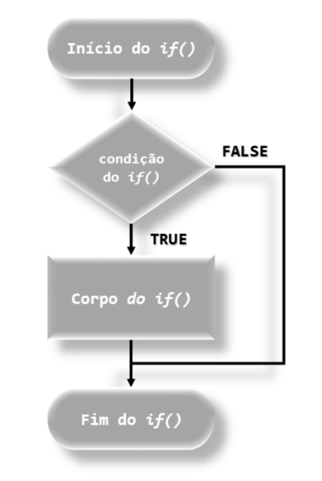
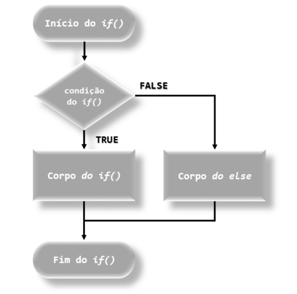
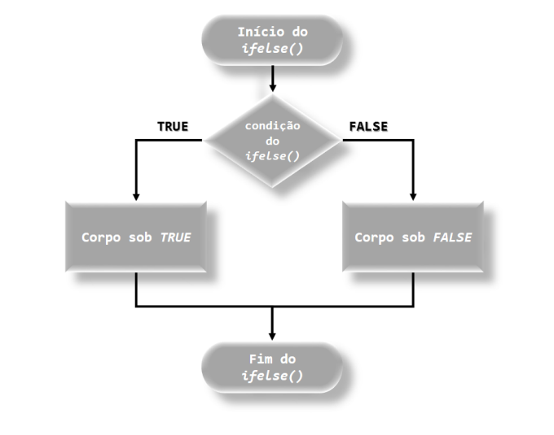
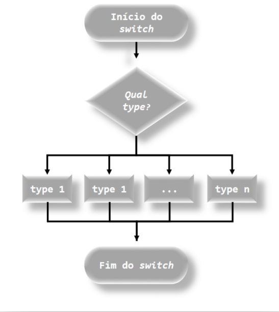
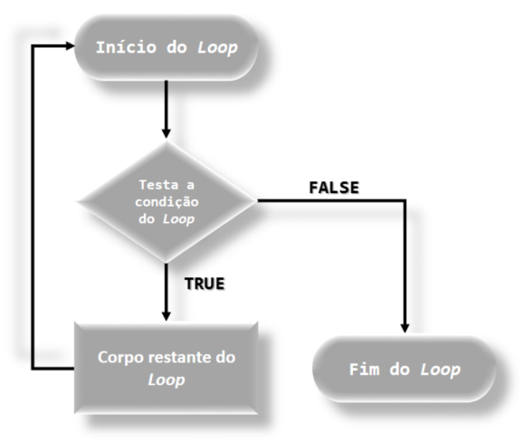
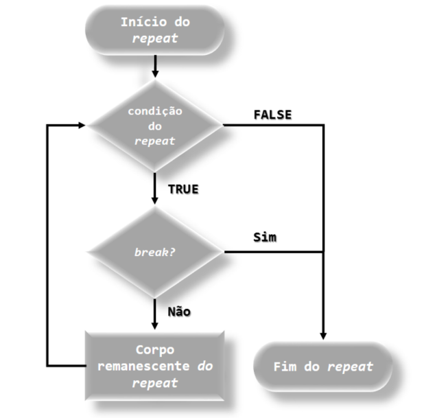
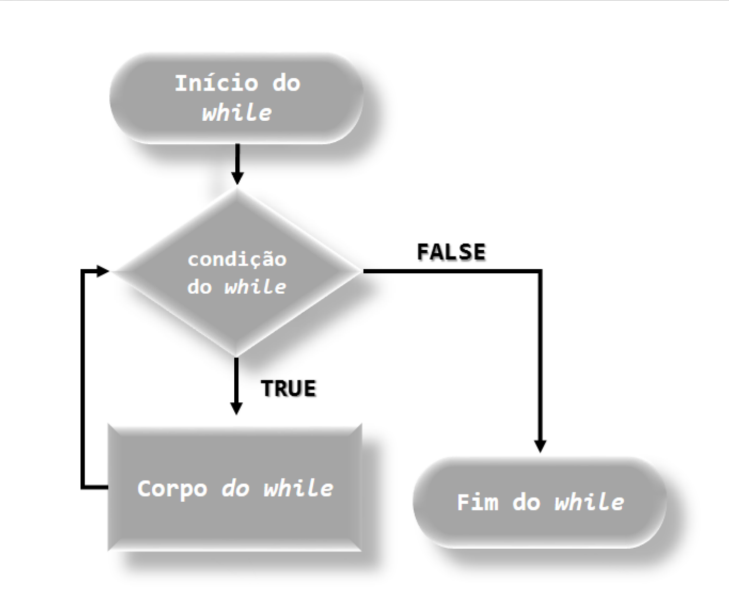

# Funções no R

## Introdução

Mais uma vez, nos reportamos aos princípios do **R** (CHAMBERS, 2016), mais especificamente ao segundo princípio, “Tudo que acontece no **R** é uma chamada de função”. Quando associamos um nome a um objeto (x <- 10) pelo símbolo de atribuição (<-), o que temos é uma chamada de função realizando esse processo, isto é, ‘<-‘(x, 10). Ao digitar x no console e posteriormente apertando o botão ENTER do teclado, nos bastidores, estamos na realidade chamando a função print(x) para imprimir o valor que o nome se associa. Desde coisas básicas como essas, até coisas mais complexas, temos sempre por trás uma chamada de função.

## O que é uma função no R?

Os princípios falados por Chambers (2016) são interligados, principalmente os dois primeiros, porque apesar de tudo que acontece no R ser uma chamada de função, a função é um objeto, com estrutura definida como qualquer outro objeto, de modo function()1 ,assim como os vetores. Ainda mais, dizemos que a linguagem R tem um estilo funcional, devido a esse fato. Mais isso é assunto para o Volume II.

A ideia de função aqui não é pensada como uma relação matemática, mas como um sistema que tem uma entrada e saída. Podemos ter funções no ambiente R que organiza dados, e não operações matemáticas por exemplo. Vejamos a função sort() do pacote base que ordena de forma crescente ou descrescente um conjunto de valores, como pode ser observado no Código R 6.1.

As funções de modo closure (funções criadas por meio de function(), do qual o seu modo pode ser verificado por typeof()), apresenta três estruturas básicas: argumento, corpo e ambiente, que será abordada a seguir.


## Estrutura básica de uma função

As funções podem ser dividas em três componentes:

- Argumentos, função formals(),
- Corpo, função body() e
- Ambiente, função environment().

Para o caso das funções primitivas, escritas na linguagem C, essa regra foge a excessão, e será detalhado no Volume II. Dizemos que funções são primitivas de modo builtin ou special. Para verificarmos a tipagem desses objetos, devemos sempre usar typeof() ou invés de mode().


```{r echo=TRUE, prompt=TRUE}
 # Vetor
 y <- c(5, 3, 4); y

```

```{r echo=TRUE, prompt=TRUE}

 # Funcao
 sort(x = y)


```

```{r echo=TRUE, prompt=TRUE}

 # Argumentos da funcao sort
 formals(sort)


```


```{r echo=TRUE, prompt=TRUE}
 # Corpo da funcao
 body(sort)


```


```{r echo=TRUE, prompt=TRUE}

 # Ambiente
 environment(sort)

```

Nesse caso, os argumentos x, decreascing e ..., são nomes que aguardam receber objetos para a execução da função sort(). Nem todos os argumentos necessitam receber objetos, a estes chamamos de argumentos padrão, como o caso do argumento decreascing com padrão igual a FALSE, que significa que o ordenamento dos dados será de forma não-decrescente. Observe que na função sort() entramos apenas com o argumento x = y, não precisando inserir decreascing = FALSE. Agora, para modificar o argumento padrão, basta acrescentar a alteração na função, isto é,

```{r echo=TRUE, prompt=TRUE}
 # Funcao
 sort(x = y, decreasing = TRUE)

```
O ’...’ é um argumento especial e significa que pode conter qualquer número de argumentos. Geralmente é utilizado em uma função quando não se sabe o número exato de argumentos. Veremos ainda nesse capítulo mais sobre esse argumento. 

O próximo item é o corpo da função. É nele que inserirmos as instruções, isto é, as linhas de comandos necessárias a que se destina a sua criação. Uma outra forma de acessarmos o corpo das funções é digitar no console apenas o seu nome sem o parêntese, isto é, sort.

Por fim, o ambiente que no caso da função sort() representa o ambiente do pacote base, isto é, o namespace **base**.

## Funções em pacotes

Podemos observar que essas funções utilizadas até agora, não foram criadas pelo usuário. Estas funções vieram do que chamamos de pacotes2. Alguns pacotes estão disponíveis quando instalamos o **R** , dizemos que estes são os pacotes nativos do **R** , para a linguagem. O principal pacote deles é o **base**. Os demais pacotes desenvolvidos podem ser obtidos via CRAN, e falaremos mais adiante.

O ambiente **R** apresenta uma versatilidade de manuais para a linguagem. Por exemplo, para verificar informações sobre um determinado pacote como o **base**, use help(package = ’base’). A função help() pode ser utilizada para funções de pacotes anexados. Por exemplo, help(’sort’). Uma outra função que pode ser usada para procurar por funções com determinado parte de nome é apropos(), isto é, para o exemplo anterior, temos apropost(’sort’). O pacote **base** sempre estará anexado, isto é, disponível no caminho de busca para a utilização. Para os que não estão anexados, a função help deve informar o nome da função que necessita de ajuda, bem como o seu pacote. Por exemplo, temos uma função read.dbf() do pacote **foreign**, Base do **R** , porém, esse pacote não está anexado3 ao inicializar o **R**. Assim, caso não seja anexado o pacote, basta executar library(’foreign’) no console. A ajuda sobre a função pode ser realizada com help(’read.dbf’, package = ’foreign’). Outras sintaxes para a função help() é usar ? antes do nome de uma função de um pacote anexado, isto é, ?sort()‘ para o caso da função estudada.

Para os manuais de ajuda na internet, use ?? antes do nome da função, por exemplo ??sort(), read.dbf(), etc. Essa sintaxe não precisa dos pacotes estarem anexados para ajuda de determinada função, porém o pacote necessita estar instalado. Para mais detalhes sobre pacotes, leia o Capítulo 9.


## Chamadas de funções

As chamadas de funções podem ocorrer de três formas: aninhada, intermediária ou de forma pipe. Todas essas formas estão implementadas no R de forma nativa, porém este último, foi implementado inicialmente pelo pacote magrittr, e na versão do R 4.1, foi implementado o operador pipe nativo (|>), sendo aprofundado no Volume II.

Suponha que desejamos calcular o desvio padrão de um conjunto de valores. Vamos utilizar as três formas de chamadas de função, que segue:

- Aninhado:

```{r echo=TRUE, prompt=TRUE}
# Gerando 100 numeros aleatorios de uma distribuicao normal
set.seed(10) # Semente
 x <- rnorm(100)
 # Calculando o desvio padrao
 sqrt(var(x))


```
- Intermediária:

```{r echo=TRUE, prompt=TRUE}
 # Calculando o desvio padrao
 vari <- var(x)
 desvpad <- sqrt(vari); desvpad


```


- Pipe:

```{r echo=TRUE, prompt=TRUE}
# Para usar o pipe (magrittr), substitua |> por %>%, e instale e anexe o pacote:
# install.packages(magrittr)
 library(magrittr)
# Calculando o desvio padrao
 x  %>% 
  var()%>%
 sqrt()

```
A ideia da chamada de função aninhada é inserir função como argumento de funções sem necessidade de associar nomes aos objetos. A ordem de execução começa sempre da direita para a esquerda. No caso da chamada de função intermediária, associamos nomes a cada função, e os passos seguem. Por fim, o operador especial pipe (%>%) tem como primeiro operando o primeiro argumento da função no segundo operando.

Quando desenvolvemos pacotes, preferimos os dois primeiros, pois é a forma tradicional de chamadas de função no R . A chamada de função pipe é muito utilizada para ciência de dados, uma vez que trabalhamos com manipulações de dados, visualizações gráficas, sem necessariamente precisarmos associar nomes aos objetos, de modo a armazenar seus resultados. Dessa forma é preferível o operador pipe.


## Estruturas de controle

As funções que utilizaremos, a seguir, são utilizadas quando desejamos realizar processos repetitivos para um determinado fim ou condicionado, as famosas estruturas de controle. Assim, como em outras linguagens, as funções utilizadas são: *if()*, *switch()*, *ifelse()*, *while()*, *repeat*, *for()*. Todos esses nomes são reservados no ambiente R, isto é, não podemos associar esses nomes a objetos. Esses objetos tem modo special4 ,porque as expressão não são necessariamente avaliadas. Já a função ifelse() é de modo closure. Este último é um tipo de objeto que é uma função criada por function(), e será o mesmo tipo de objeto que os usuários terão quando desenvolverem as suas próprias funções.

A sintaxe das estruturas de controle de tipo special é:

```{r echo=TRUE, prompt=TRUE}
 função (condição) {
 expressão
 }

```

A sintaxe das funções repeat e swicth() foge um pouco desse padrão, e explicaremos em sua aplicação, mais a frente. Apesar da linguagem **R** ser interpretada, acaba ganhando a fama de que as funções loops são mais lentas. Em alguns casos, a construção do algoritmo proporciona isso e não a implementação dessas funções em si. Um exemplo que podemos citar, são as cópias de objetos que podem ter um gasto de memória ativa imenso no processo e proporcionar um gasto computacional. E isso foi devido a forma de como o algoritmo copiou os objetos, e não o desempenho das funções loops. Veremos isso em detalhes no Volume II.

A primeira estrutura é o if(), com sintaxe:

```{r echo=TRUE, prompt=TRUE}

 if (condição) {
 # Corpo do if()
 #instruções sob condição = TRUE
 }

```

O fluxograma para o entendimento da função if() pode ser observado na Figura 6.1. Podemos também representar a função if() sintaticamente com a função else da seguinte forma:

Agora, acrescentando a função else trabalhando conjuntamente com a função if(), temos a sua forma sintática dada por:

```{r echo=TRUE, prompt=TRUE}
  if (condição) {
 # Corpo do if()
#instruções sob condição = TRUE
 } else {
 # Corpo do else
# instruções sob condição = FALSE
 }

```
em que o fluxograma da combinação dessas duas funções podem ser representados pela Figura \@ref(fig:FluxogramadaFuncaoif).

Uma forma mais simplificada unindo as funções if() e else, resultaram na função ifelse(), que pode ser representada sintaticamente da seguinte forma:

```{r FluxogramadaFuncaoif, fig.cap = "Fluxograma da função if()", out.width = "80%", fig.align='center'}

```

```{r FluxogramaElse, fig.cap = " Modelo estrutural de um banco de dados", out.width = "80%", fig.align='center'}

```

```{r echo=TRUE, prompt=TRUE}
 if (condição) instr1
 if (condição) instr1 else instr2
```

```{r echo=TRUE, prompt=TRUE}
 # Objeto
 i <- 5
 # Estrutura if()
 if (i > 3) {
 print("Maior␣que␣3!")
 }
```
Como observado no Código R 6.2, após associado o nome x associado ao objeto 5, isto é i <- 5, a função if() foi chamada e a condição foi verificada se i < 3. Como essa condição era verdadeira, a expressão sob a condição verdadeira é impressa, e a função if é encerrada. Vejamos mais um exemplo no Código R 6.3, a seguir.

```{r echo=TRUE, prompt=TRUE}
 # Objeto numerico
 x <- 10
 # Estrutura 'if'
 if (is.numeric(x)) {
 print("Isso␣é␣um␣número")
 } else {
 print("Isso␣não␣é␣um␣número")
 }


```

```{r echo=TRUE, prompt=TRUE}
 # eh o mesmo que
 if (is.numeric(x) == TRUE) {
 print("Isso␣é␣um␣número")
 } else {
 print("Isso␣não␣é␣um␣número")
 }


```
Observamos na primeira forma que a condição para if() avaliar, nós não precisamos perguntar se is.numeric(x) == TRUE, porque isso já é implícito na função, e acaba levando a primeira expressão print("Isso é um número"). De todo modo, em um segundo momento explicitamos a condição, e verificamos que o resultado para este caso será o mesmo. No R , essa estrutura de controle não é vetorizado, isto é, se a condição houver um vetor lógico maior que 1, apenas os primeiros itens serão usados. Para entender, vejamos o Código R 6.4.

```{r echo=TRUE, prompt=TRUE}
 # Objetos
 x <- 5
 w <- 3:8
 # Primeira sintaxe (Preferivel)
 if (x < w) {
 x
 } else {
 w
 }


```

```{r echo=TRUE, prompt=TRUE}
 # Segunda forma
 if (x < w) x else w

```

Observamos que o fato de x < y ser vetorizado, tivemos problema com a condição if(). A partir de w > 5, o resultado era para ter retornado sempre o valor 5, isto é, o valor verdadeiro (x) para a condição. Isso implica que a condição deve ser sempre entre vetores escalares. Uma saída seria utilizar a função for(), conjugada com if() e else. Porém, como forma de vetorizar essa condição, foi criado a função ifelse(), em que o fluxograma dessa função pode ser observado pela Figura , cuja forma sintática é dada a seguir.

```{r echo=TRUE, prompt=TRUE}
ifelse (condição, expressão sob TRUE, expressão sob FALSE)

```
Podemos ver que a aplicação do Código R 6.4 retornou um resultado que não se esperaria como o desejado, pelo fato da função if() não ser vetorizada. Assim, por meio do Código R 6.5 usando

```{r FluxogramaIfElse, fig.cap = "Fluxograma da função ifelse()", out.width = "80%", fig.align='center'}

```

a função ifelse(), verificaremos que esta por ser vetorizada, o resultado retornado ocorre como
esperado.

```{r echo=TRUE, prompt=TRUE}
 # Objetos
 x <- 5
 w <- 3:8
 # Primeira sintaxe (Preferivel)
 ifelse(x < w, x, w)
```

Podemos estar interessados em resultados específicos para determinadas condições, e daí, usar o que chamamos de programação defensiva, podendo ser apresentado no Código R 6.6.

```{r echo=TRUE, prompt=TRUE}
 x <- 2 # numero

 # Estrutura 'if'
 if (!is.numeric(x)) {
 "Nao_eh_numero"
 } else {
 if ((trunc(x) %% 2) == 0) {
 cat("numero_par:␣", trunc(x))
 } else {
 if ((trunc(x) %% 2) == 1) {
 cat("numero_impar:␣", trunc(x))
 }
 }
 }


```
A ideia no Código R 6.6 é escolher um numero inteiro o algoritmo verificar se este é par ou ímpar. O que pode ocorrer como supostos erros que foram protegidos pelo código, o primeiro é de se avaliar um valor que não seja número. Nesse caso, a primeira condição if(!is.numeric(x)) retornar uma mensagem que o valor não é um número. O segundo erro que poderia ocorrer é do valor inserido não ser um número inteiro. Nesse caso, truncamos o número apenas usando a sua parte inteira e desprezando a decimal, sem o arredondamento. Tentar evitar erros previsíveis, é o que chamamos de programação defensiva, uma forma do próprio usuário conseguir identificar o erro mais facilmente.

Um próximo exemplo, apresentado no Código R 6.6, mostrará inicialmente por meio da condição if() e else pode se apresentar um código mais complexo, sendo simplificado na sequência com o uso da função switch(), Código R 6.8. O fluxograma da função switch() pode ser observado pela Figura \@ref(fig:FluxogramaSwitch).


```{r FluxogramaSwitch, fig.cap = "Fluxograma da função switch().", out.width = "80%", fig.align='center'}

```

```{r echo=TRUE, prompt=TRUE}
 # Objeto
 set.seed(15) # Fixando a semente
 x <- rnorm(1000) # Gerando 1000 numeros aleatorios
 # medida descritiva
 opcao <- "media" # opcoes: "media", "mediana", "medapar" (media aparada)
 if (opcao == "media") {
 cat("A␣média␣aritmética␣é:", round(mean(x), 4))
 } else {
 if (opcao == "mediana") {
 cat("A␣mediana␣é:", round(mean(x), 4))
 } else {
 if (opcao == "medapar") {
 cat("A␣média␣aparada␣é:", round(mean(x, trim = 0.1), 4))
 }
 }
 }


```

```{r echo=TRUE, prompt=TRUE}
 # Objeto
 set.seed(15) # Fixando a semente
 x <- rnorm(1000) # Gerando 1000 numeros aleatorios
 # medida descritiva
 opcao <- "media" # opcoes: "media", "mediana", "medapar" (media aparada)
 switch(opcao,
 media = cat("A␣média␣aritmética␣é:", round(mean(x), 4)),
 mediana = cat("A␣mediana␣é:", round(mean(x), 4)),
 medapar = cat("A␣média␣aparada␣é:", round(mean(x, trim = 0.1), 4)) )


```
As três estruturas básicas de loop no R são: repeat, while() e for(). Dizemos que um loop é um conjunto de instruções (expressões) em um algoritmo que se repete um número de vezes até que sejam alcançados os objetivos desejados. A repetição é controlada pelo contador, um objeto R . Cada repetição represeta um ciclo do loop. Enquanto a condição do loop for verdadeira, os ciclos se repetem atualizando o contador, Figura \@ref(fig:FluxogramaLoop). Algumas funções não têm condição explícita (repeat e while), e precisam de funções adicionais em suas expressões.

```{r FluxogramaLoop, fig.cap = "Fluxograma do loop", out.width = "80%", fig.align='center'}

```

A primeira função loop é repeat, apresentamos sua sintaxe:

```{r echo=TRUE, prompt=TRUE}
 repeat {
 expressão ...
 }
```

Juntamente com o repeat, usamos as funções break e next, pois a função repeat não tem uma
condição explícita. Para o entendimento, criamos dois fluxogramas, sendo o primeiro entendendo a função repeat junto com a função break e o outro a função repeat juntamente com a função next, dos quais podem ser verificadas pelas Figuras \@ref(fig:FluxogramaRepeatBreak) e \@ref(fig:FluxogramaRepeatNext), respectivamente. Vejamos, alguns exemplos para essas funções, iniciando pelo Código R 6.9.

```{r FluxogramaRepeatBreak, fig.cap = "Fluxograma das funções repeat e break", out.width = "80%", fig.align='center'}

```

```{r FluxogramaRepeatNext, fig.cap = "Fluxograma das funções repeat e next", out.width = "80%", fig.align='center'}
knitr::include_graphics("img/Fluxograma_Funcao_repeat_next.png")
```
```{r echo=TRUE, prompt=TRUE}
 # Contador
 i <- 1
 # Loop repeat
 repeat {
 if (i > 5) {
 break
 } else {
 print(i)
 i <- i + 1
 }
 }


```
Observamos que a condição em repeat se repete até i > 5, ou seja, será impresso apenas os
valores de 1 a 5. Para que isso ocorra, nós quebramos o ciclo de repetição com a função break,
em que o objeto i <- 1 [linha 1, Código R 6.9] é o contador do ciclo. Percebemos que cada ciclo apresenta no console como resultado a execução print(i) [linha 8, Código R 6.9], e que na sequência, o contador se atualiza, i <- i + 1 [linha 9, Código R 6.9]. Essa situação se repete enquanto i < 6, porque nessa situação a condição em else é sempre a executada. Assim, no momento em que o contador i é igual a 5, esse valor é impresso no console, e na sequência este é atualizado para i <- 5 + 1, isto é, o contador assume valor igual a 6. Nesse momento, o ciclo recomeça e quando a linha 5 é avaliada, a condição i > 5 passa a ser verdadeira, então a linha 6 é avaliado e função break entra em ação. Isso resulta na quebra do ciclo, e então a função repeat é encerrada. O próximo exemplo no Código 6.10, apresentamos a função next.

```{r echo=TRUE, prompt=TRUE}
 # Contador
 i <- 1
 # Loop repeat
 repeat {
 if (i > 5) {
 break
}
 else {
 if (i == 3) {
 i <- i + 1
  next
 print(i + 1)
 }
 print(i)
 i <- i + 1
 }
 }


```
O que diferencia o Código R 6.9 para o Código R 6.10 é o acréscimo da função next ao código. Quando a condição if(i == 3) [linha 9, Código R 6.10] é verdadeira, as linhas 10 e 11 são executadas. Primeiro atualizamos o contador i <- 3 + 1 [linha 10, Código R 6.10] e posteriormente, a função next [linha 10, Código R 6.10] é executada. Inserimos a linha 12 no Código R 6.10] para termos a ideia da função next, que é avançar o ciclo quando esta função é executada, ou seja, quando o contador quando assume valor 3, as linhas 10 e 11 são executadas, e após a função next ser chamada, as linhas 12, 14 e 15 não são executadas, porque se fossem, o valor 5 seria impresso duas vezes, e isso não ocorreu. O que aconteceu foi o avanço de ciclo. Devemos ter uma atenção a função repeat, porque como ela não tem um critério de parada explícito, podemos incorrer em um loop infinito.

Similar a função repeat(), temos a função while(), que agora, temos uma condição de parada, cujo fluxograma é dado pela Figura \@ref(fig:FluxogramaWhile), com sintaxe dada por:

```{r echo=TRUE, prompt=TRUE}
 while (condição) {
 expressão ...
 }


```

```{r FluxogramaWhile, fig.cap = "Fluxograma da função while", out.width = "80%", fig.align='center'}

```


Nessa função, também podemos usar as funções break e next, como usados na função repeat. Vejamos o exemplo no Código R 6.11.

```{r echo=TRUE, prompt=TRUE}
 # Contador
 i <- 1
 # Loop while
 while (i <= 5) {
 print(i)
 i <- i + 1
 }

```
Nesse caso, não foi necessário utilizar a função break, devido a condição que ela permite impor
ao ciclo. Vejamos um outro exemplo, no Código R 6.12.

```{r echo=TRUE, prompt=TRUE}
 # Contador
 i <- 1
 # Loop while
 while (i <= 5) {
 if (i == 3) {
 i <- i + 1
 next
 }
 print(i)
 i <- i + 1
 }


```
Observamos a utilização da função next, similar ao que foi realizado com a função repeat. Por
fim, a função for(), com cuja sintaxe é dada por:

```{r echo=TRUE, prompt=TRUE}
 for (contador in lista) {
 expressão ...
 }
```

Com essa função, também podemos utilizar break e next. Porém, o controle do ciclo nessa
situação é maior, e menos necessário essas funções. Vejamos a Figura \@ref(fig:FluxogramaFuncaoFor).

```{r FluxogramaFuncaoFor, fig.cap = "Fluxograma da função for()", out.width = "80%", fig.align='center'}
knitr::include_graphics("img/Fluxograma_Funcao_for.png")
```
```{r echo=TRUE, prompt=TRUE}
 # Loop for
 for (i in 1:5) {
 print(i)
 }

```
Observamos que a implementação, dos algoritmos anteriores, é bem mais simples usando a função for(). Vejamos um próximo exemplo, no Código R 6.14.

```{r echo=TRUE, prompt=TRUE}
 # Loop for
 for (i in 1:5) {
 if (i == 3) {
 next
 }
 print(i)
 }
```
Mais uma vez, foi utilizado a função next, sem necessidade agora, de atualizar o contador i, uma vez que já está definido na função for(). Veremos na próxima subseção, que temos funções de alto nível que podem substituir as funções loops. São as chamadas funções da família apply.


## Criando funções

Até esse momento, usamos funções já desenvolvidas no **R**, seja dos pacotes nativos, seja via instalação dos pacotes via CRAN. Agora, iremos desenvolver as nossas próprias funções.

Como falado anteriormente, no início, a estrutura da função criada se mantém, argumento, corpo e ambiente. Para isso, usaremos a função function(). O modo desse objeto é closure5. Vejamos a sua sintaxe,

```{r echo=TRUE, prompt=TRUE}
 # Forma usual
 nome_funcao <- function(arg1, arg2, ...) {
 corpo: comandos..
 }
 # Forma simplificada
 nome_funcao <- function(arg1, arg2, ...) corpo
```

Desse modo, apresentamos o primeiro exemplo no Código R 6.15, a seguir

```{r echo=TRUE, prompt=TRUE}
 # Criando a funcao 'fun1'
 fun1 <- function(x) {
 res <- x + 1
 return(res)
 }
```

Nesse caso, temos uma função chamada fun1(), cujo argumento de entrada é x. Observemos que uma função é como um objeto do tipo vector, associamos um nome ao objeto da mesma forma. O corpo apresenta uma delimitação por chaves ..., em que apresenta um comando de atribuição, cujo nome res se associa ao resultado da soma x + 1. Por fim, o resultado dessa função, imprime res, por meio da função return(). Para executar fun1(), fazemos:

```{r echo=TRUE, prompt=TRUE}
fun1(x = 5)
```

O que aconteceu foi que ao assumir x = 5 no argumento, essa informação foi repassada para o corpo da função fun1(), aonde existia o nome x, que se associou ao objeto 5, para esse caso. A função + é chamada, e a expressão x + 1 é avaliada, cujo nome res se associa ao resultado dessa expressão. Por fim, quando a função fun1() é chamada, o resultado de res é impressa no console, por meio de return(res). Vamos verificar os três componentes da função fun1() no console, isto é,

```{r echo=TRUE, prompt=TRUE}
 # Argumentos
formals(fun1)
$x
 # Corpo
 body(fun1)
{
res <- x + 1
return(res)
}
 # Ambiente
 environment(fun1)
<environment: R_GlobalEnv>

```

O corpo da função é executado de forma sequencial, a partir da primeira linha de comando até a última. Apesar de recomendado, também não é obrigatório o uso da função return(), são as chamadas saídas explícitas6, sendo observado como segue,

```{r echo=TRUE, prompt=TRUE}
  # Funcao
  fun2 <- function(x) x + 1
  # Executando
```


### Função anônima

Podemos também ter o que chamamos de função anônima, da qual não associamos nome as funções. Contudo, sendo criada esta não pode ser recuperada como qualquer outro objeto. Essa forma é interessante quando não precisamos dela após o seu uso. Por exemplo, queremos calcular a integral,

$$ \int_{0}^{1} x^2 \,dx=\frac{1}{3} $$
e criamos uma função $x^2$. Então,

```{r echo=TRUE, prompt=TRUE}
 integrate(f = function(x) x^2,
 lower = 0,
 upper = 1)
```

A função integrate() é utilizada para o cálculo de integral, do qual, passamos os argumentos, função (f), limite inferior (lower) e limite superior (upper) da integração, respectivamente. Observemos que não houve necessidade de nomear a função no argumento, pois não há objetivo de ser reutilizado. Isso também ocorre muito na área de ciência de dados, quando muitas vezes fazemos manipulações com os dados ao mesmo tempo, sem necessidade de associar nomes aos resultados intermediários.


### Chamadas de função

As chamadas de funções ocorrem de três formas: aninhado, intermediário e via pipe. Vejamos o cálculo do desvio padrão novamente, Código R 6.16.

```{r echo=TRUE, prompt=TRUE}
 # Funcao auxiliar 1
 aux1 <- function(x) x - mean(x)
 # Funcao auxiliar 2
 aux2 <- function(x) x^2
 # Funcao auxiliar 3
 aux3 <- function(x) {
 sum(x) / (length(x) - 1)
 }
 # Gerando 100 numeros aleatorios de uma distribuicao normal
 set.seed(10)
 x <- rnorm(100)
 # Calculo do desvio padrao (aninhado)
 sqrt(aux3(aux2(aux1(x))))


```
```{r echo=TRUE, prompt=TRUE}
 # Calculo do desvio padrao (intemediario)
 dp <- aux1(x)
 dp <- aux2(dp)
 dp <- aux3(dp)
 dp <- sqrt(dp)
 dp


```


```{r echo=TRUE, prompt=TRUE}
 # Calculo do desvio padrao (pipe)
 x |>
 aux1() |>
 aux2() |>
 aux3() |>
 sqrt()


```

Mais detalhes sobre esses três aspectos serão abordados no Volume II.


### Ordenação de argumentos

Os argumentos nas funções podem ser nomeados ou não. Quando nomeados, a ordem como são
inseridos na função não importa. Já os argumentos não nomeados, seus valores precisam estar na ordem como a função foi desenvolvida. Vejamos o Código R 6.17, para entender melhor.

```{r echo=TRUE, prompt=TRUE}
 estdesc <- function(x, opcao) {
 res <- switch(opcao,
 media = round(mean(x), 4),
 mediana = round(mean(x), 4),
 medapar = round(mean(x, trim = 0.1), 4))
 return(res)
 }
 # Objeto
 set.seed(15)
 x <- rnorm(1000)
 # Argumentos nomeados na funcao
 estdesc(x = x, opcao = "media")

```

```{r echo=TRUE, prompt=TRUE}
estdesc(opcao = "media", x = x)

```


```{r echo=TRUE, prompt=TRUE}
 # Argumentos não nomeados ordenados
 estdesc(x, "media")


```


```{r echo=TRUE, prompt=TRUE}
 # Argumentos não ordenados (Gera erro)
 estdesc("media", x)

```

### Objeto reticências (“...”)

O objeto reticências é do tipo pairlist, um tipo de objeto usado bastante internamente no **R** , e dificilmente utilizado no código interpretado. Desse modo, não temos acesso direto a estrutura do objeto .... Contudo, esse objeto tem um papel fundamental nas funções, quando damos a liberdade de inserir mais argumentos além dos definidos na criação da função. Esse argumento é usado na função plot(), por exemplo, do pacote nativo **base**. Vejamos como o argumento ... pode ser usado em uma função, no Código R 6.18.

```{r echo=TRUE, prompt=TRUE}

 # Funcao que plota um grafico
 grafico <- function(x, y, ...) {
 plot(x = x, y = y, ...)
 }
 # Vetores
 x <- 1:10; y <- rnorm(10)
 # Chamada 1, com os argumentos definidos
 grafico(x = x, y = y)
```

```{r echo=TRUE, prompt=TRUE}
 # Chamada 2, inserindo argumentos nao definidos
 grafico(x = x, y = y, main = "Título")


```

Isso ocorre, porque temos a função plot() no corpo da função grafico() que apresenta muitos
argumentos. Dessa forma, criamos a função grafico(), com os argumentos que representam as coordenadas, mas a reticências ('...') garantem que os demais argumentos da função plot, omitidos, possam ser utilizados.

## Escopo léxico

Vamos retornar aos componentes da função fun1(), desenvolvido no Código R 6.15, reapresentando novamente as três estruturas de uma função,

```{r echo=TRUE, prompt=TRUE}
 # Argumentos
 formals(fun1)
$x
 # Corpo
 body(fun1)
{
res <- x + 1
return(res)
}
 # Ambiente
 environment(fun1)
<environment: R_GlobalEnv>

```
Observemos que o último componente é o ambiente onde o nome fun1 foi associado a função.
Este ambiente é chamado de **ambiente envolvente**. Nesse caso é o ambiente global. Contudo, quando a função é executada, momentaneamente é criado o **ambiente de execução**. É neste ambiente que os nomes que estão no corpo da função são associados aos objetos. Vejamos um primeiro exemplo, Código R 6.19.

```{r echo=TRUE, prompt=TRUE}
 x <- 10
fun <- function() {
 x <- 2
 x
 }
 # Chamando a funcao fun
 fun()

```

Por causa do ambiente de execução que o objeto x dentro da função é retornado, ao invés do que foi definido fora da função. Isso porque o ambiente de execução mascara os nomes definidos dentro da função dos nomes definidos fora da função. Esse é uma primeira característica do escopo léxico nas funções em R . Anteriormente, falamos sobre a atribuição, que representa a forma como os nomes se associam aos objetos. Agora, o escopo vem a ser a forma como os nomes encontram seus valores associados. O termo léxico significa que as funções podem encontrar nomes e seus respectivos valores associados, definidos no ambiente onde a função foi definida, isto é, no ambiente de função. Claro que isso segue regras, e a primeira foi a máscara de nome falada anteriormente.
Porém quando não existe um nome vinculado a um objeto, e este foi definido no ambiente de função, o valor é repassado para o corpo da função, como pode ser observado no Código R 6.20.

```{r echo=TRUE, prompt=TRUE}

 x <- 10
 fun <- function() {
 x
 }
 # Chamando a funcao fun
 fun()

```
O resultado de fun() foi 10, porque como a função procurou no ambiente de execuções e não encontrou esse nome, a função foi até o ambiente superior, no caso, o ambiente de execuções. Como falado anteriormente, todo ambiente tem um pai (ou ambiente superior). Essa hierarquização é observada no caminho de busca, que pode ser acessado por search(), ou seja,

```{r echo=TRUE, prompt=TRUE}
 search()
```

O ambiente corrente do R sempre será o ambiente ambiente global (.GlobalEnv). O ambiente de execução não aparece, porque ele é momentâneo. Então, após buscar no ambiente de execução e não encontrar, é pelo caminho de busca que a função irá procurar pelos objetos inseridos no corpo da função. Ele só existe quando a função é chamada e não quando ela é definida, isto é,

```{r echo=TRUE, prompt=TRUE}
 # Funcao
 fun <- function() x + 10
 # Objeto 1
 x <- 10
 # Chamada1
 fun()

 # Objeto 2
 x <- 20
 # Chamada 2
 fun()


```

Observe que após ser criada a função fun(), o nome x se associou ao objeto 10. Posteriormente, fun() foi chamada e o resultado foi 20. Contudo, o nome x se associou a outro objeto 20, e após a segunda chamada da função fun(), o resultado foi 30, porque a função procura os valores quando ela é executada, e não quando é criada, é a característica de pesquisa dinâmica do escopo léxico. Uma outra situação pode ser observada no Código R 6.21.

```{r echo=TRUE, prompt=TRUE}
 # Objeto
 n <- 1
 # Funcao
 fun <- function() {
   n <- n + 1
   n
 }
 # Chamada 1
 fun()
```
```{r echo=TRUE, prompt=TRUE}
 # Chamada 2
 fun()
```
Nessas linhas de comando, poderíamos pensar que após ter executado a primeira chamada, o
valor retornado seria 2, e a segunda chamada retornaria o valor 3, como ocorre com as variáveis estáticas na linguagem C, por exemplo. Aqui nesse caso, o resultado independente do número de chamadas, será sempre o mesmo porque uma outra característica do escopo léxico no **R** é o **novo** começo, porque a cada vez que a função é executada um novo ambiente de execução é criado, e portanto, cada execução dos comandos de atribuição e expressão são executados de forma independentes nas chamadas de funções.

Algo que não havíamos falado anteriormente, é que a função function() não necessariamente
necessita de definição de argumentos, devido a flexibilidade do escopo léxico das funções em **R**. É essa característica que faz com que os comandos no corpo das funções encontrem os objetos que não estão definidos na própria função. Mais detalhes, serão encontrado no *Volume II: Nível Intermediário* da coleção *Estudando o Ambiente R*.


