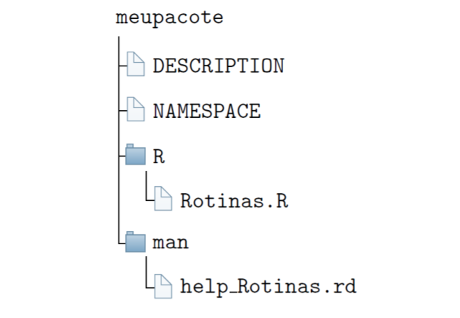

# Pacotes

## Introdução

Um pacote em **R** é um diretório de arquivos necessários para carregar um código de funções, dados, documentações de ajuda, testes, etc. O próprio **R** em sua instalação, contém 30 pacotes nativos, que contém as funções mínimas para a utilização do ambiente. No pacote, não há apenas códigos em **R** , mas um pacote fonte (do inglês, source package), contendo os arquivos mencionados acima, ou um arquivo compactado, de extensão .tar.gz do pacote fonte, ou um pacote instalado, resultado do comando **R** CMD INSTALL, que será visto no Volume V: Desenvolvimento de Pacotes **R**, coleção Estudando o Ambiente **R**. Isso acontece no SO Linux. Para as plataformas Windows e Macintosh, existem também os pacotes binários ou compactados com a extensão .zip ou .tgz, respectivamente.

Um pacote, portanto é a unidade básica para o compartilhamento de um código. Atualmente, até 01/12/2021, o número de pacotes disponíveis no CRAN é 18.524. Podemos encontrar a lista de pacotes por data de publicação ou por ordem alfabética. Qualquer usuário pode publicar um pacote e disponibilizá-lo sob o CRAN. Para isso, uma série de testes iniciais são realizados no próprio ambiente R , para verificar se o pacote em desenvolvimento não contém problemas previsíveis, e posteriormente, uma checagem mais aprofundada, após a submissão, é realizada por algum dos mantenedores do **R** (**R** Development Core Team). Isso significa dizer que se um pacote está disponível no CRAN, além de sua estabilidade, o pacote será executável nas três plataformas mais usadas em sistema operacional, SO Linux ou sitemas Unix, SO Windows e SO Macintosh. Isso é um padrão hoje no **R**.

Há outros repositórios que podem ser disponibilizados os pacotes, como por exemplo, Biocondutor, R-forge, GitHub. Este último está sendo muito utilizado, nesses últimos anos. Porém, quando os pacotes estão em repositórios diferentes do CRAN, não haverá garantias dos padrões mencionados anteriormente. Além do mais, devemos entender que a principal preocupação dos mantenedores do **R**, é que os pacotes funcionem corretamente, naquilo em que os mesmos objetivam, mas em nada é discutido sobre a metodologia científica, ou de análises, a que o pacote se destina. Isso é verificado, quando o pacote após disponível no CRAN, também é submetido para o journal do **R**, o The R Journal ou ao Journal of Statistical Software, por exemplo. Aí sim, o pacote é esmiuçado tanto no aspecto computacional, quanto no metodológico.

Portanto, entenda que nem todo pacote sob o CRAN é confiável naquilo que se propõe, o que não significa dizer, que um pacote é confiável se apenas tiver sido publicado nas revistas anteriores ou em qualquer outra específica para a área de interesse, mas a cautela é sempre necessária, tentando entender quem são os desenvolvedores, ou fazendo uma pesquisa mais ampla sobre o referido pacote, para que assim, a decisão da escolha seja confiável. Fazemos esse adendo, porque quando se vai pesquisar sobre um determinado assunto poderá existir diversos pacotes para o mesmo, e a pergunta será, qual pacote devemos escolher? Aquele que é mais fácil utilizar? E daí, uma boa pesquisa para a escolha não deve ser levado apenas em consideração a facilidade de utilização do pacote, mas saber se as funções do pacote realmente retornam os resultados confiáveis para aquilo que se destina. Fica a nossa dica.

Para uma instalação mais rápida dos pacotes, optem pelos espelhos disponíveis nos países em que vivem, uma vez que a transferência de dados ocorrem mais rapidamente. Aqui no Brasil, por exemplo, o primeiro espelho desenvolvido e ativo até hoje é o da UFPR. Mas, temos mais quatro espelhos: dois na USP, uma na Fiocruz/RJ, e outra na UESC.

Um termo que deve ficar claro, que erroneamente, alguns usuários chamam o termo biblioteca como um sinônimo de pacote. Nas documentações do **R** , biblioteca é o diretório onde os pacotes são instalados, também chamados de diretório de biblioteca ou diretório de árvores. O outro sentido de biblioteca é o de biblioteca compartilhada (dinâmica ou estática), que armazenam código compilado que se vinculam aos pacotes, por exemplo, no Windows são as DLLs.


## Estrutura básica de um pacote

A estrutura básica de um pacote é apresentada na Figura \@ref(fig:EsqueletoBasicoPacote)

```{r EsqueletoBasicoPacote, echo=FALSE, out.width="100%", fig.cap="Esqueleto básico de um pacote",fig.align='center'}

```

Vejamos as ideias básicas desses subdiretórios e arquivos:

a) **DESCRIPTION**: Esse é um arquivo de texto, contendo informações básicas como o título do pacote, versão, licença, descrição, nome dos autores, e o mantenedor do pacote, isto é, para quando um pacote estiver com problema ou o CRAN entre em contato, será para este último. Esses as informações obrigatórias que devem ter nesse arquivo;

b) **NAMESPACE**: Esse arquivo embora tenha tenha muita semelhança com a linguagem R , o seu conteúdo, se destina a importação e exportação de funções no pacote. Será nesse arquivo, que diremos quais os pacotes que ele depende, isto é, as funções, e quais as funções exportadas, visíveis, que devem ser apresentadas aos usuários;

c) **R/**: Esse subdiretório apresenta os scripts com as funções em R . é o cérebro do pacote;


d) **man/**: Esse subdiretório apresenta os arquivos de ajuda, com extensão .Rd. Isso significa, que uma vez instalado o pacote no R , o acesso aos manuais de ajuda do referido pacote, estarão disponíveis, graças a esses arquivos.

Claro, que quando os pacotes se tornam mais complexos, outros subdiretórios e arquivos são
necessário. Mas isso é assunto para o *Volume V: Desenvolvimento de Pacotes R*, coleção *Estudando o Ambiente R*.


## Instalação de um pacote

A instalação de um pacote via **R** pode ser feito pela função install.packages(pkgs = "nome_pacote"). Por exemplo, vamos tentar instalar o pacote **midrangeMCP**, da seguinte forma:

```{r echo=TRUE, prompt=TRUE}
install.packages("midrangeMCP")
```
Pode ser que nesse processo, dependendo de onde o usuário esteja executando essa linha de comando, interface do **R** ou **RStudio**, que seja solicitado o espelho por onde deseja fazer a instalação. Isso é apenas um atalho para ter um acesso mais rápido na instalação do pacote. A sugestão é escolher um espelho de seu país de origem.

Uma forma simples de se ter detalhes do pacote na internet, tais como, baixar o pacote fonte ou o pacote binário do midrangeMCP, por exemplo, é sempre usar essa url: <http://cran.r-project. org/package=midrangeMCP>. Para qualquer outro pacote, basta mudar o nome do pacote na url, e assim, estaremos na página do repositório do pacote. O pacote fonte, como falado anteriormente, é compactado com extensão *.tar.gz*, no caso, midrangeMCP_3.1.1.tar.gz. O pacote binário tem a compactação zipada, midrangeMCP_3.1.1.tar.zip para o Windows e midrangeMCP_3.1.1.tgz para o Macintosh. O acesso aos arquivos do pacote mencionados no esqueleto são disponíveis no pacote fonte.

Uma outra forma possível de instalação é baixar o arquivo do pacote fonte para o seu computador e instalá-lo, via comando:

```{r echo=TRUE, prompt=TRUE}
 install.packages(pkgs = "./midrangeMCP.tar.gz", repos = NULL, type = "source")
```

Consideramos que o arquivo do pacote esteja no diretório de trabalho do usuário. Caso contrário, deve ser informado o local onde pacote se encontra no computador. Para o Window ou Macintosh, é possível instalar também, a partir dos pacotes binários.

Muitos dos desenvolvedores, estão disponibilizando seus projetos de pacotes, principalmente no **GitHub**, inclusive com manuals de ajuda com maiores detalhes. Pode ser possível instalar esses pacotes por esse repositório. Precisamos inicialmente do pacote **devtools**, e posteriormente a instalação do pacote. Segue as linhas de comando:

```{r echo=TRUE, prompt=TRUE}
install.packages("devtools")
install_github("bendeivide/midrangeMCP")
```

Contudo, devemos dar a preferência pela instalação via CRAN. Por lá, teremos a garantia que os pacotes estão estáveis para a utilização nas referidas plataformas mencionadas acima.

Alguns pacotes, por falta de manutenção, seja por atualizações do **R** ou por qualquer outro motivo, podem se tornar incompatíveis para utilização sobre alguns dos três sistemas operacionais básicos (*SO Windows, Unix e SO Mac*) exigidos pelo **R**. Dessa forma, se as correções não forem feitas, estes pacotes e tornam órfãos, ou seja, desativados sob o CRAN. O primeiros pacotes sob o *CRAN*, por exemplo, não tinham o arquivo **NAMESPACE**, que hoje é exigido. Qualquer tentativa de instalação desses pacotes nessas situações, não serão bem sucedidas. Dessa forma, fizemos uma vídeo-aula, como tentativa de recuperar os pacotes desativados. Porém, deixemos claro que nem sempre é possível a instalação de pacotes desativados.


## Objetivos de um pacote

A ideia de um pacote para um usuário **R** deve representar como uma ferramenta para otimizar suas atividades do dia-a-dia na utilização da linguagem. Suponha que o usuário seja um cientista de dados, e todos os dias ele carrega uma sequência de scripts, via source, para disponibilizar suas funções no ambiente global. Isso acaba gerando processos repetitivos de trabalho desnecessários.

Ao invés, o cientista de dados pode desenvolver um pacote, e esse pacote conter todas as funções necessárias para as suas análises. De uma vez, o pacote instalado e anexado no caminho de busca, todas as suas funções estarão disponíveis para utilização. Portanto, o entendimento disso, permite uma maior eficiência de trabalho.

Outro ponto é que a experiência contida em um pacote pode ser propagada mais facilmente para outros usuários, mostrando que o conhecimento é uma liberdade necessária. Tanto pelo CRAN, quanto por outras plataformas, o pacote pode ser disponibilizado.


## Utilizar as funções de um pacote

Uma vez instalado o pacote, precisamos carregar e anexá-lo, para que possamos utilizar os recursos disponíveis no pacote, como funções, dados, etc. Isso significa, disponibilizar na memória e inseri-lo no caminho de busca, respectivamente. Para fazer essas duas ações ao mesmo tempo, use a função library() ou require(). A primeira função se for utilizada sem argumento algum, retorna todos os pacotes instalados na biblioteca de pacotes do R . Vejamos o exemplo do pacote **midrangeMCP**, no Código R 9.1.

```{r echo=TRUE, prompt=TRUE}
 # Carregando e anexando o pacote midrangeMCP
library(midrangeMCP)
# Usando a função MRtest() desse pacote
 #-----
 # Dados simulados de um experimento em DIC (Delineamento Inteiramente Casualizado)
# Variavel resposta
 rv <- c(100.08, 105.66, 97.64, 100.11, 102.60, 121.29, 100.80,
8 + 99.11, 104.43, 122.18, 119.49, 124.37, 123.19, 134.16,
9 + 125.67, 128.88, 148.07, 134.27, 151.53, 127.31)
 # Tratamento
 treat <- factor(rep(LETTERS[1:5], each = 4))
 # Anava
 res <- anova(aov(rv~treat))
 DFerror <- res$Df[2]
 MSerror <- res$`Mean Sq`[2]
 # Aplicando testes
 results <- midrangeMCP::MRtest(y = rv,
 trt = treat,
 dferror = DFerror,
 mserror = MSerror,
 alpha = 0.05,
 main = "PCMs",
 MCP = c("all"))

```
```{r echo=TRUE, prompt=TRUE}
midrangeMCP::MRbarplot(results)
```


## Carregando e anexando um pacote

Anteriormente, falamos que usamos a função library() ou require() para carregar e anexar um pacote para utilizar suas funções, após a instalação. Carregar um pacote significa disponibilizar na memória ativa. Para acessar uma função de um pacote após ter sido carregado, usamos o operador ::, isto é, nome_pacote::nome_função. Isto significa, que será chamado a função necessária sem anexar o pacote no caminho de busca. Estudaremos no Capítulo 10, um pouco mais sobre caminho de busca. Para esse momento, entendamos que é um caminho hierarquizado de ambientes, isto é, objetos que armazenam, em forma de lista, nomes associados a objetos. A função para ver o caminho de busca é search(), como pode ser observado no Código R 9.2.

```{r echo=TRUE, prompt=TRUE}
 # Caminho de busca
  search()
```

```{r echo=TRUE, prompt=TRUE}
# Carregando e chamando uma função de um pacote
midrangeMCP::MRwrite(results, extension = "latex")

```
Com as linhas de comando apresentadas anteriormente, percebemos ao executar a função MRwrite() do pacote midrangeMCP, usando :: que o caminho de busca não foi alterado. Isso significa que o pacote não foi anexado, apenas carregado, ou seja, se o usuário desejar usar alguma função do pacote digitando apenas o nome no console, não será possível, porque o pacote não está anexado ao caminho de busca. Vejamos outra situação pelo Código R 9.3.

```{r echo=TRUE, prompt=TRUE}
 # Caso o pacote midrangeMCP esteja anexado, use:
 # detach("package:midrangeMCP", unload = TRUE)
 # Caminho de busca
 search()

 # Carregando e anexando um pacote
 library(midrangeMCP)
 # Verificando novamente o caminho de busca
 search()
 # Chamando uma funcao do pacote
 guimidrangeMCP()


```
Com o uso da função *library()*, percebemos que o caminho de busca foi alterado, porque agora temos o ambiente de pacote *package:midrangeMCP*. Isso significa que agora poderemos acessar os objetos desse pacote apenas digitando o nome associado a eles. Por fim, a última linha de comando, representa a interface gráfica ao usuário para o pacote, o que chamamos de *GUI* (do inglês, *Graphical User Interface*).


## NAMESPACE de um pacote

No início da seção sobre pacotes, falamos sobre o esqueleto de um pacote, isto é, os componentes básicos de um pacote. Um dos arquivos foi o **NAMESPACE**. Esse arquivo é responsável pela exportação e importação de funções. As funções exportadas de um pacote, por meio desse arquivo, são aquelas visíveis após a anexação do pacote ao caminho de busca, ou por meio do operador ::. As funções importadas são aquelas utilizadas de outros pacotes, utilizadas internamente ao referido pacote.

As funções ditas internas são aquelas não mencionadas no **NAMESPACE**. Em muitas situações, precisamos de funções internas necessárias para a finalidade do pacote, que muitas vezes não é objetivo final para disponibilidade dos usuários, mas códigos intermediários para a boa funcionabilidade do pacote. Dessa forma, uma boa escolha para que não haja conflitos em nomes associados a objetos no ambiente de trabalho, é a decisão de não exportá-los.

Porém, quando se cria um pacote, por exemplo, pelo **RStudio** , o padrão no **NAMESPACE**
é o comando: exportPattern(''^[^\\.]''), que significa que todas as funções no pacote serão
exportadas que não iniciam por um ponto (".").


## Documentações de um pacote

Toda função exportada de um pacote precisa de um arquivo de ajuda (.Rd). Rodas as funções deverão ter esses tipos arquivos inseridos no subdiretório man/. Mais detalhes sobre o desenvolvimento de pacotes será abordado no *Volume V: Desenvolvimento de Pacotes R, coleção Estudando o Ambiente R*.

## Operadores :: e :::

Como falamos anteriormente, para chamarmos uma função sem a necessidade de anexar o pacote, usamos o operador ::. Comentamos também, que algumas funções não eram exportadas pelo NAMESPACE de um pacote. Contudo, se desejarmos visualizar ou executá-las, poderemos utilizar o operador ‘:::‘. Vejamos um exemplo, nas linhas de comando a seguir.

```{r echo=TRUE, prompt=TRUE}
 # Instale o pacote SMR
 # install.packages(SMR) # Descomente a linha de comando para instalar
 # Carregando e chamando funcoes exportadas do pacote SMR
 SMR::pSMR(q = 2, size = 10, df = 3)
 # Carregando e chamando funcoes nao exportadas ao pacote
 SMR:::GaussLegendre(size = 4)


```

As funções internas dos pacotes devem ser utilizadas com muita cautela, uma vez que são funções que podem passar por atualizações, mudanças. Isso porque, como não são funções exportadas, alguns pacotes podem passar por atualizações, e desse modo, estas funções também podem ser atualizadas ou até mesmo alteradas.

Outro ponto interessante é que não se recomenda a utilização de importação de funções internas de outros pacotes no desenvolvimento de pacotes, uma vez que são funções que podem passar por mudanças drásticas, e portanto, gerar problemas nas rotinas. Se uma função em um pacote não foi exportada, é porque o desenvolvedor tem um bom motivo para tal situação. As funções exportadas são de fato a essência do objetivo de um pacote, e por isso que elas são exportadas.
