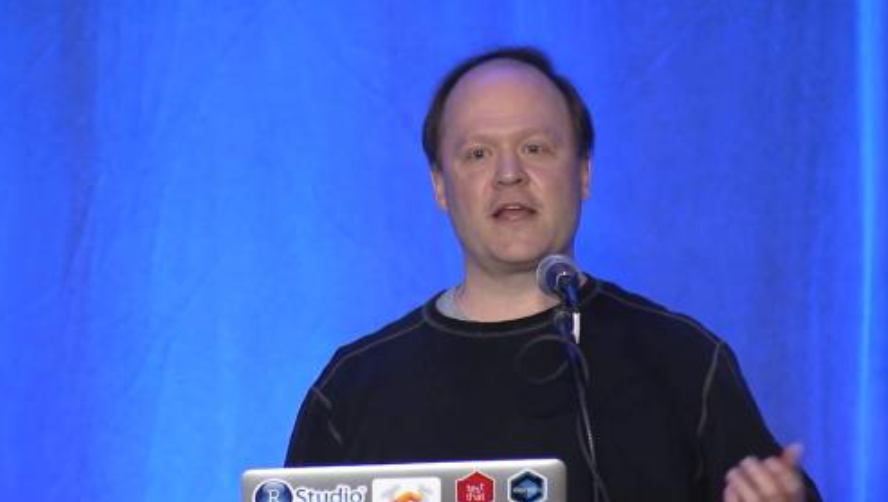
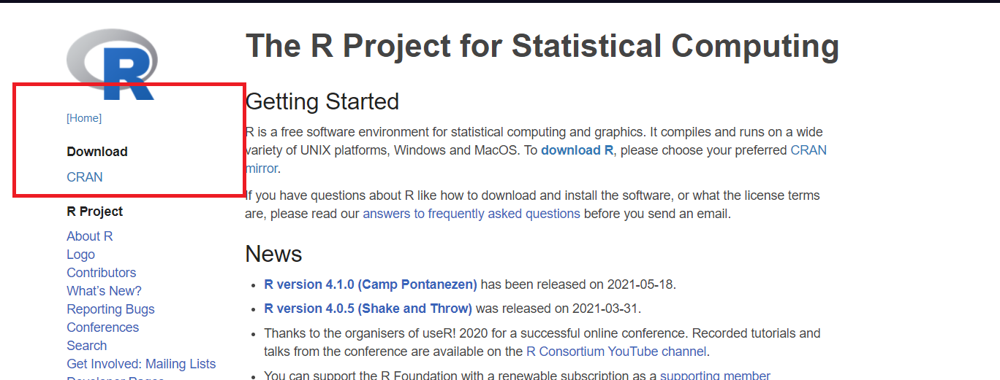
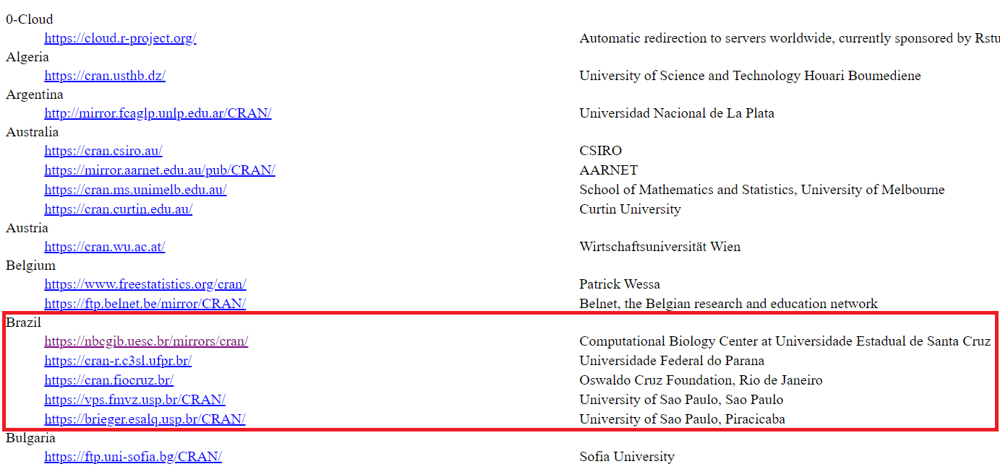

<!-- # (PART) Programação em R (Nível Básico) {-} -->

# História e instalação do R

A linguagem **R** tem a sua primeira aparição científica publicada em 1996, com o artigo intitulado
R: A Language for Data Analysis and Graphics, cujos os autores são os desenvolvedores da linguagem,
George Ross Ihaka e Robert Clifford Gentleman.

(\#fig:CriadoresR)Criadores do R.

Durante a época em que estes professores trabalhavam na Universidade de Auckland, Nova Zelândia, desenvolvendo uma implementação alternativa da lingugagem S, desenvolvida por John Chambers, que comercialmente era o **S-PLUS**, nasceu em 1991, o projeto da linguagem **R** , em que em 1993 o projeto é divulgado e em 1995, o primeiro lançamento oficial, como software livre com
a licença GNU. Devido a demanda de correções da linguagem que estava acima da capacidade de
atualização em tempo real, foi criado em 1997, um grupo central voluntário, responsável por essas
atualizações, o conhecido R Development Core Team2, que hoje está em 20 membros (atualizado
em 5 de novembro de 2021): Douglas Bates, John Chambers, Peter Delgaard, Robert Gentleman,
Kurt Hornik, Ross Ihaka, Tomas Kalibera, Michael Lawrence, Friedrich Leisch, Uwe Ligges, Thomas
Lumley, Martin Maechler, Sebastian Meyer, Paul Murrel, Martyn Plummer, Brian Ripley, Deepayan
Sarkarm, Duncan Temple Lang, Luke Tierney e Simon Urbanek. Por fim, o CRAN (Comprehensive R Archive Network) foi oficialmente anunciado em 23 de abril de 1997 3. O CRAN é um conjunto de sites (espelhos) que transportam material idêntico, com
as contribuições do **R** de uma forma geral.

## O que é o R ?

R é uma linguagem de programação e ambiente de software livre e código aberto (open source). Entendemos4:

- **Software livre**: *software* que respeita a liberdade e sendo de comunidade dos usuários, isto é, os usuários possuem a liberdade de executar, copiar, distribuir, estudar, mudar, melhorar o *software*. Ainda reforça que um *software* é livre se os seus usuários possuem quatro liberdades:

    1. Liberdade 0 - A liberdade de executar o programa como você desejar, para qualquer propósito;
    2. Liberdade 1 - A liberdade de estudar como o programa funciona, e adaptá-la as suas necessidades;
    3. Liberdade 2 - A liberdade de redistribuir cópias de modo que você possa ajudar outros;
    4. Liberdade 3 - A liberdade de distribuir cópias de suas versões modificadas a outros;
  
Algo que deve estar claro é que um *software* livre não significa não comercial. Sem esse fim, o *software* livre não atingiria seus objetivos. Agora perceba que, segundo Richard Stallman, a ideia de software livre faz campanha pela liberdade para os usuários da computação. Por outro lado, o código aberto valoriza principalmente a vantagem prática e não faz campanha por princípios.

- *Código aberto*: Para Richard Stallman 6 código aberto apoia critérios um pouco mais flexíveis que os do software livre. Todos os códigos abertos de software livre lançados se qualificariam como código aberto. Quase todos os softwares de código aberto são software livre, mas há exceções, como algumas licenças de código aberto que são restritivas demais, de forma que elas não se qualificam como licenças livres. Nesse contexto, o autor cita muitas situações que diferenciam os dois termos. Vale a pena a leitura.

A linguagem **R** é uma combinação da linguagem S com a semântica de escopo léxico da linguagem Scheme. Dessa forma, a linguagem **R** se diferencia em dois aspectos principais 7:

- **Gerenciamento de memória**: usando as próprias palavras de Ross Ihaka, em **R**, alocamos uma quantidade fixa de memória na inicialização e a gerenciamos com um coletor de lixo dinâmico. Isso significa que há muito pouco crescimento de *heap* e, como resultado, há menos problemas de paginação do que os vistos em S.

- **Escopo**: na linguagem *R*, as funções acessam as variáveis criadas pelo o corpo da própria função, como também as variáveis contidas no ambiente que a função foi criada. No caso da linguagem S, isso não ocorre, assim, como por exemplo na linguagem C, em que as funções acessam apenas variáveis definidas globalmente.

Vejamos alguns exemplos para entendimento (Se você ainda não está ambientado ao **R**, estude esse módulo primeiro, e depois reflita sobre esses exemplos). Antes de executar as linhas de comando, instale o pacote **lobstr** como segue:

$$CODIGO$$

Como a linguagem *S* é uma linguagem interpretada cuja base é a linguagem *FORTRAN*, a linguagem *R* também é uma linguagem interpretada e baseada além da linguagem *S*, tem como base as linguagens de baixo nível *C*, *FORTRAN* e a própria linguagem *R*.

Embora o *R* tenha uma interface baseada em linhas de comando, existem muitas interfaces gráficas ao usuário com destaque ao *RStudio*, criado por Joseph J. Allaire, Figura \@ref(fig:CriadorRStudio).

(\#fig:CriadorRStudio)J. J. Allaire, o criador do RStudio

Essa interface tornou o *R* mais popular, pois além de produzir,hoje, pacotes de grande utilização como a família de pacotes *tidyverse*, **rmarkdown**, **shiny**, dentre outros, permite uma eficiente capacidade de trabalho de análise de utilização do **R**. Uma vez que o **RStudio** facilita a utilização de muitos recursos por meio de botões, como por exemplo, a criação de um pacote *R*. Há quem diga que para um iniciante em **R**, não seja recomendado utilizar o *RStudio* para o entendimento da linguagem. Cremos, que o problema não é a IDE utilizada, e sim, o caminho onde deseja chegar com a linguagem **R**.

No Brasil, o primeiro espelho do CRAN foi criado na UFPR, pelo grupo do Prof. Paulo Justiniano. Inclusive um dos primeiros materiais mais completos sobre a linguagem **R** produzidos no Brasil, foi dele, iniciado em 2005, intitulado "Introdução ao Ambiente Estatístico **R**". Vale a pena assistirmos do evento a palestra: R Reflexões: um pouco de história e experiências com o R, proferida pelo Prof. Paulo Justiniano Ribeiro Júnior, no R Day - Encontro nacional de usuários do R, ocorrido em 2018 em Curitiba/UFPR, do qual o vídeo está disponível no Canal (Youtube) LEG UFPR.

## Instalação do R e RStudio 

Para realizarmos a instalação do ambiente **R** , uma vez que o **RStudio** é apenas uma IDE, e sem o **R**, não há sentido instalá-lo, seguimos os seguintes passos:

- Instalação do R - <https://www.r-project.org>, Figura \@ref(fig:InstalacaoR01) e \@ref(fig:InstalacaoR02):

(\#fig:InstalacaoR01) Primeiro passo para Instalação do R

<!-- IMAGEM 02 -->

(\#fig:InstalacaoR02)Segundo passo para Instalação do R

- Instalação do RStudio - <https://rstudio.com/products/rstudio/download/#download>:

Justificamos a utilização do **RStudio** pela quantidade de recursos disponíveis e a diversidade de usuários **R**, que hoje o perfil não é apenas de um programador, mas de um usuário que necessita de uma ferramenta estatística para análise de seus dados. Dessa forma, até por questão de praticidade, e de uso pessoal, não deixaremos de repassar o entendimento sobre a linguagem **R** com o uso do **RStudio**.

Outra coisa importante, é que esses passos para a instalação do R e RStudio se basearam no sistema operacional Windows, mas para detalhes sobre essas instalações em outros sistemas operacionais, acesse: 
<https://bendeivide.github.io/cursor>.

(\#fig:unnamed-chunk-1)Instalação do RStudio

