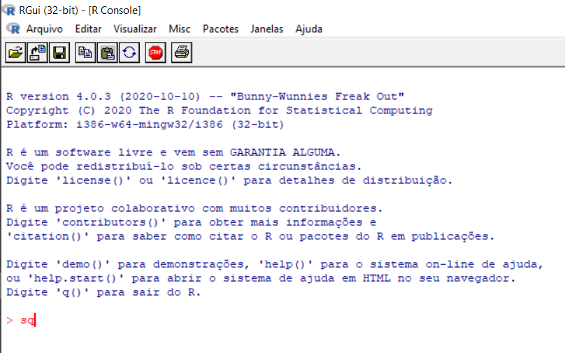
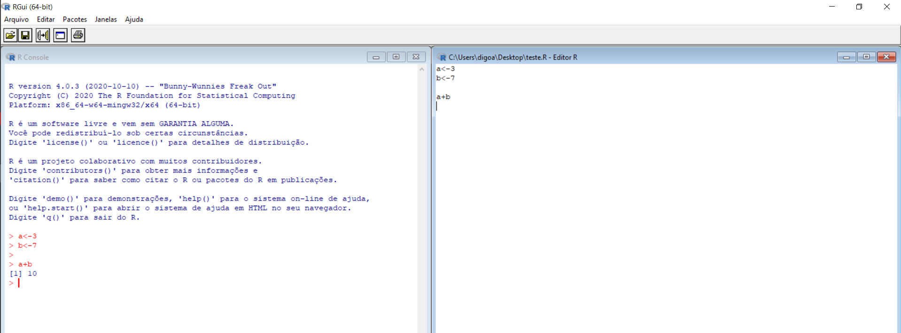

---
output:
  pdf_document: default
  html_document: default
---


<div class="figure" style="text-align: center">

<p class="caption">(\#fig:unnamed-chunk-1) Primeiro passo para Instalação do R</p>
</div>


# Introdução ao R

## Como o R trabalha

Iniciamos a discussão por uma afirmação de John McKinley Chambers, do qual afirmou que o R tem três princípios (Chambers 2016):


<div class="figure" style="text-align: center">

<p class="caption">(\#fig:CriadorS)John Chambers, o criador da linguagem S</p>
</div>

- **Princípio do Objeto**: Tudo que existe em R é um objeto;
- **Princípio da Função**: Tudo que acontece no R é uma chamada de função;
- **Princípio da Interface**: Interfaces para outros programas são parte do *R*;

Ao longo de todo o curso, para os três módulos, iremos nos referir a esses princípios. Vamos inicialmente observar uma adaptação da ilustração feita por Paradis (2005), mostrando como o R trabalha, Figura \@ref(fig:FuncionamentoR).

<div class="figure" style="text-align: center">

<p class="caption">(\#fig:FuncionamentoR)Esquema de como o R funciona.</p>
</div>

Toda ação que acontece no *R* é uma chamada de função (*Operadores* e *Funções*), que por sua vez é armazenada na forma de um objeto, e este se associa a um nome. A forma de execução de uma *função* é baseada em argumentos (dados, fórmulas, expressões, etc), que são entradas, ou argumentos padrões que já são pré-estabelecidos na criação da função. Esses tipos de argumentos podem ser modificados na execução da função. Por fim, a saída é o resultado, que é também um objeto, e pode ser usado como argumento de outras funções.

Figura \@ref(fig:FuncionamentoR), observamos que todas as ações realizadas sobre os objetos ficam armazenadas na memória ativa do computador. Esses objetos são criados por comandos (teclado ou mouse) através de funções ou operadores (chamada de função), dos quais leem ou escrevem arquivos de dados do disco rígido, ou leem da própria internet. Por fim, o resultado desses objetos podem ser apresentados no console (memória ativa), exportados em formato de imagem, página web, etc. (disco rígido), ou até mesmo ser reaproveitado como argumento de outras funções, porque o resultado também é um objeto.

## Comandos no R e Ambiente Global

### Console e *Prompt* de comando

Como falado anteriormente, o *R* é uma linguagem baseada em linhas de comando, e as linhas de comando, são executadas uma de cada vez, no console. Assim que o prompt de comando está visível na tela do console, o R indica que o usuário está pronto para inserir as linhas de comando. O símbolo padrão do prompt de comando é “>”, porém, ele pode ser alterado. Para isso, use a linha de comando, por exemplo:


```r
options(prompt = "R>")
# Toda vez que o console iniciar, começarar por 'R>'
10
```

```
## [1] 10
```


O conjunto de símbolos que podem ser utilizados no R depende do sistema operacional e do país em que o R está sendo executado. Basicamente, todos os símbolos alfanuméricos podem ser utilizados, mas para evitar problemas quanto ao uso das letras aos nomes, opte pelos caracteres ASCII.

A escolha do nome associado a um objeto tem algumas regras:

- Deve consistir em letras, ponto, underline. Ex.: .ben_;

```r
.ben_<-"UFSJ"
.ben_
```

```
## [1] "UFSJ"
```


- Os nomes devem ser iniciados por uma letra ou um ponto não seguido de um número, isto é, Ex.: .123, 1n, dentre outros;

```r
.123<-2021
.123
```

```r
Error in 0.123 <- 2 : lado esquerdo da atribuição inválida (do_set)
```

- As letras maiúsculas se distinguem das letras minúscula (case sensitive) Ex.: Diego $\neq$ diEgO;


```r
Diego <-"05/07"

diEgO <-"1993"

Diego
```

```
## [1] "05/07"
```

```r
diEgO
```

```
## [1] "1993"
```

- Não pode iniciar por _ ou caracteres especiais, é retornado um erro no console caso isso ocorra. Ex.: _teste, ?teste, &teste, dentre outros ;

```r
_teste<-12345

```
```r
Erro: unexpected input in "_"

```


- Não pode usar qualquer uma das palavras reservadas pela linguagem, isto é, *TRUE*, *FALSE*, *if*, *for*, dentre outras, que pode ser consultado usando o comando *?Reserved()*.

```r
TRUE <-"Hello World"

```

```r
Error in TRUE <- "Hello World" : 
  lado esquerdo da atribuição inválida (do_set)

```

Um nome que não segue essas regras é chamado de um nome **não sintático**. Um comando que pode ser usado para converter nomes **não sintatícos** em nomes **sintáticos** é *make.names()*.


```r
make.names("@123")
```

```
## [1] "X.123"
```


Apesar dessas justificativas, algumas situações como as apresentadas nos exemplos anteriores são possíveis, ver Wickham (2019) na Seção 2.2.1.

### Comandos elementares

Os **comandos elementares** podem ser divididos em **expressões** e **atribuições**. Por exemplo, podemos estar interessados em resolver a seguinte expressão $10+15=25$. No console quando passamos pelo comando:


```r
10 + 15
```

```
## [1] 25
```


O *R* avalia essa expressão internamente e imprime o resultado na tela, após apertar o botão ENTER do teclado. Esse fato é o que ocorre no segundo princípio mencionado por Chambers (2016), tudo em R acontece por uma chamada de função. Na realidade o símbolo + é uma função interna do R, que chamamos de função primitiva, porque foi implementada em outra linguagem. Assim, essa é o resultado de três objetos ("10" "+" "15") que são avaliados internamente, do qual a função + é chamada, e em seguida o resuldo é impresso no console.

Do mesmo modo, se houver algum problema em algum dos objetos o retorno da avaliação pode ser uma mensagem de erro. Um caso muito prático é quando utilizamos o separador de casas decimais, sendo a **vírgula ","**, para os números. Quando na realidade deve ser um **ponto "."**, respeitando o sistema internacional de medidas. A vírgula é utilizada para separar elementos, argumentos em uma função, etc. Vejamos o exemplo:

``` r
10,5 + 15,5
```
``` r
Erro: ',' inesperado in "10,"
```

Porém, tem que ficar claro que uma expressão é qualquer comando repassado no console. Este comando é avaliado e seu resultado impresso, há menos que explicitamente o usuário queira torná-lo invisível. Caso algum elemento do comando não seja reconhecido pelo R, há um retorno de alguma mensagem em forma de *“erro” ou “alerta”* tentando indicar o possível problema. Todos esses processos ocorrem na memória ativa do computador, e uma vez que o resultado é impresso no console, o valor é perdido, há menos que você atribua essa expressão a um nome, que erroneamento usamos o termo: "criamos um objeto!". A *atribuição* dessa expressão será dada pela junção de dois símbolos **"<-"** falado mais a frente. Um comando em forma de atribuição também avalia a sua expressão, um nome se associa ao seu resultado, e o resultado será mostrado, se posteriormente, após a execução você digitar o “nome” atribuído a esse resultado. Vejamos um exemplo:


```r
# Foi criado um objeto do tipo caractere e o nome "meu_nome" foi associado a ele
# O 'R' avalia essa expressão, mas não imprime no console!
meu_nome <- "Ben"

# Para imprimir o resultado da expressão, digitamos o nome "meu_nome" no console
# e apertamos o botão ENTER do teclado!
meu_nome
```

```
## [1] "Ben"
```


### Execução de comandos

Quando inserimos um comando no console, executamos uma linha de comando por vez ou separados por “;” em uma mesma linha. Vejamos


```r
# Uma linha de comando por vez
meu_nome <- "Ben" # Criamos e associamos um nome ao objeto
meu_nome # Imprimos o objeto
```

```
## [1] "Ben"
```


```r
# Tudo em uma linha de comando
meu_nome <- "Ben"; meu_nome
```

```
## [1] "Ben"
```

Se um comando for muito grande e não couber em uma linha, ou caso deseje completar um comando em mais de uma linha, após a primeira linha, haverá o símbolo **"+"** iniciando a linha seguinte ao invés do símbolo de prompt de comando *">"*, até que o comando esteja sintaticamente completo. Vejamos:


```r
# Uma linha de comando em mais de uma linha
(10 + 10) /
  2
```

```
## [1] 10
```

Por fim, todas as linhas de comando que iniciam pelo símbolo jogo da velha, **"#"**, indica um comentário e essa linha de comando não é avaliada pelo console, apenas impressa na tela. E ainda, as linhas de comandos no console são limitadas a aproximadamente 4095 bytes (não caracteres).

### Chamada e correção de comandos anteriores

Uma vez que um comando foi executado no console, esse comando pode ser recuperado usando os botões de *setas* para *cima* e para *baixo* do teclado. Já com as teclas de setas *esquerda* e *direita*, os caracteres podem ser alterados, removidos com o botão Delete ou Backspace, ou acrescentados digitando os caracteres necessários. Experimente executar comandos simples de soma, por exemplo, e logo após tente recuperá-lo, altere e execute novamente.


Uma outra forma de completar determinados comandos já existentes, como por exemplo, uma função que já existe nas bibliotecas de instalação do R, utiliza-se o *botão Tab* do teclado. O usuário começa digitando as iniciais, e, para completar o nome, aperta a *tecla Tab*. Posteriormente, basta completar a linha de comando e apertar ENTER para executá-la. Vejamos um exemplo a seguir:


<div class="figure" style="text-align: center">

<p class="caption">(\#fig:CompletarFuncaoR)Completando função sqrt utilizando a tecla TAB no Console R.</p>
</div>


Usar esses recursos no RStudio se torna algo mais dinâmico e vai mais além. Por exemplo, o uso da tecla TAB para completar a função "sqrt" faz com que mostre opções similares abaixo e a direita uma janela flutuante surge para explicar a função.

<div class="figure" style="text-align: center">

<p class="caption">(\#fig:CompletarFuncaoRStudio)Completando função sqrt utilizando a tecla TAB no RStudio</p>
</div>


Quando usamos um objeto do tipo função, estes apresentam o que chamamos de argumento(s) dentro do parêntese de uma função, do qual são elementos necessários, para que a função seja executada corretamente. Nesse caso, ao inserir o nome dessas funções no console, usando o RStudio, ao iniciá-la com a abertura do parêntese, abre-se uma janela informando todos os argumentos possíveis dessa função. 

<div class="figure" style="text-align: center">

<p class="caption">(\#fig:FuncaoArgumento)Janela informando todos os argumentos possíveis da função sqrt.</p>
</div>


Isso torna muito dinâmico escrever linhas de comando, porque não precisaremos estar lembrando do nome dos argumentos de uma função, mas apenas entender o objetivo dessa função.


### Ambiente Global (área de trabalho ou *Workspace*)

Quando usamos um comando de atribuição no console, o R armazena o nome associado ao objeto criado na área de trabalho (**Workspace**), que nós chamamos de Ambiente Global. Teremos uma seção introdutória na seção *Ambientes e caminhos de busca*, mas entendamos inicialmente que o objetivo de um ambiente é associar um conjunto de nomes a um conjunto de valores. Por exemplo:


```r
# Nomes criados no ambiente 
x <- 10 - 6; y <- 10 + 4; w <- "Maria Isabel"
# Verificando o nomes contidos no ambiente global
ls()
```

```
## [1] "diEgO"    "Diego"    "meu_nome" "w"        "x"        "y"
```

 Observe que todos os objetos criados até o momento estão listados, e o que é mais surpreendente é que ambientes podem conter outros ambientes e até mesmo se conter. Observe o objeto meu_nome é um ambiente e está contido no Ambiente global. Será sempre dessa forma que recuperaremos um objeto criado no console do R. Caso contrário, se no console esse comando não for de atribuição esse objeto é perdido.
 

## Arquivos `.RData` e `.Rhistory`

Ao final do que falamos até agora, todo o processo de inserir linhas de comando no console, ao finalizar os trabalhos do ambiente R, dois arquivos são criados sob a instrução do usuário em querer aceitar ou não, um .RData e outro .Rhistory, cujas finalidades são:

- **RData**: salvar todos os objetos criados que estão atualmente disponíveis;
- **Rhistory**: salvar todas as linhas de comandos inseridas no console.

## Criando e salvando um *script*

A melhor forma de armazenarmos nossas linhas de código inseridas no console é criando um *Script*. Este é um arquivo de texto com a extensão *".R"*. Uma vez criada, poderemos ao final salvar o arquivo e guardá-lo para utilizar futuramente.

No R, ao ser iniciado, podemos ir no menu em Arquivo > Novo script... Posteriormente, pode ser inserido as linhas de comando, executadas no console pela tecla de atalho F5. As janelas do Script e Console possivelmente ficarão sobrepostas. Para uma melhor utilização, estas janelas podem ficar lado a lado, configurando-as no menu em Janelas > Dividir na horizontal (ou Dividir lado a lado).


<div class="figure" style="text-align: center">

<p class="caption">(\#fig:ExecutandoScriptConsoleR)Janelas Console e Script lado a lado, o Script foi executado apertando F5.</p>
</div>

No RStudio, podemos criar um Script no menu em File > New File > R Script, ou diretamente no ícone abaixo da opção File no menu, cujo o símbolo é um arquivo com o símbolo “+” em verde, que é o ícone do New File, e escolher R Script. Esse arquivo abrirá no primeiro quadrante na interface do RStudio.


<div class="figure" style="text-align: center">

<p class="caption">(\#fig:ExecutandoScriptConsoleRStudio)Os quatro quadrantes do RStudio. O Script fica no primeiro quadrante, o mesmo foi executado apertando CTRL + ENTER do teclado.</p>
</div>


Para salvar, devemos clicar no botão com o símbolo de disquete (R/RStudio), escolher o nome do arquivo e o diretório onde o arquivo será armazenado no seu computador. Algumas ressalvas devem ser feitas:

- Escolha sempre um nome sem caracteres especiais, com acentos, etc.;
- Escolha sempre um nome curto ou abreviado, que identifique a finalidade das linhas de comando escritas;
- Evite espaços se o nome do arquivo for composto. Para isso, use o símbolo underline "_";
- Quando escrever um código, evite também escrever caracteres especiais, exceto em casos de necessidade, como imprimir um texto na tela, títulos na criação de gráficos, dentre outras. Nos referimos especificamente, nos comentários do código.

Um ponto bem interessante é o diretório. Quando criamos um Script a primeira vez, e trabalhamos nele a pós a criação, muitos erros podem ser encontrados de início. Um problema clássico é a importação de dados. O usuário tem um conjunto de dados e deseja fazer a importação para o R, porém, mesmo com todos os comandos corretos, o console retorna um erro, informando que não existe esse arquivo que contém os dados para serem informados. Isso é devido ao diretório de trabalho atual. Para verificar qual o diretório que está trabalhando no momento, use a linha de comando:


```r
getwd()
```

```
## [1] "C:/Users/digoa/Documents/GitHub/Livro_Estudando_o_Ambiente_R/book-eambr"
```

Para alterar o diretório de trabalho, o usuário deve usar a seguinte função setwd("Aqui, deve ser apontado para o local desejado!"). Supomos que salvamos o nosso Script em "C:/users/name/Documents/meus_scripts_r". Assim, usamos a função setwd e ao apontarmos o local, as barras devem ser inseridas de modo invertido, isto é, setwd("C:/users/name/Documents/meus_scripts_r"), além de estar entre aspas.

No RStudio, isso pode ser feito em Session > Set Working Directory > To Source File Location. Isso levará ao diretório destino do Script. Se desejar escolher outro diretório, vá em Session > Set Working Directory > Choose Directory.... Porém, uma vez criado um Script, e utilizado novamente, se o usuário estiver abrindo o RStudio também naquele primeiro momento, por padrão, o diretório de trabalho corrente será o mesmo do diretório do Script. Isso acaba otimizando o trabalho.

Devemos estar atentos também, quando trabalhamos utilizando Scripts ou arquivos de banco de dados em locais diferentes do diretório corrente. Um outro recurso interessante é a função source(), que tem o objetivo de executar todas as linhas de comando de um Script sem precisar abri-lo. Isso pode ser útil quando criamos funções para as nossas atividades, porém, elas não se encontram no Script de trabalho para o momento. Assim, podemos criar um Script auxiliar que armazena todas as funções criadas para as análises desejadas, e no Script corrente, poderemos chamá-las sem precisar abrir o Script auxiliar. Todos os objetos passam a estar disponíveis no ambiente global.

Por fim, algo de muita importância para um programador, **comente suas linhas de comando**. Mas faça isso a partir do primeiro dia em que você criou o seu primeiro Script. Isso criará um hábito, uma vez que o arquivo não está sendo criado apenas para um momento, mas para futuras consultas. E quando voltarmos aos Scripts com muitas linhas de comando, principalmente depois de algum tempo, e sem comentários, possivelmente você passará alguns instantes para tentar entender o que foi escrito.

<div class="figure" style="text-align: center">

<p class="caption">(\#fig:ComentarioCodigoRStudio)Comentários feitos para identificar o objetivo de cada função no Script.</p>
</div>

Outra coisa importante, é a **boa prática de escrita de um código**, e o RStudio nos proporciona algumas ferramentas interessantes. Mas isso será visto mais a frente.
