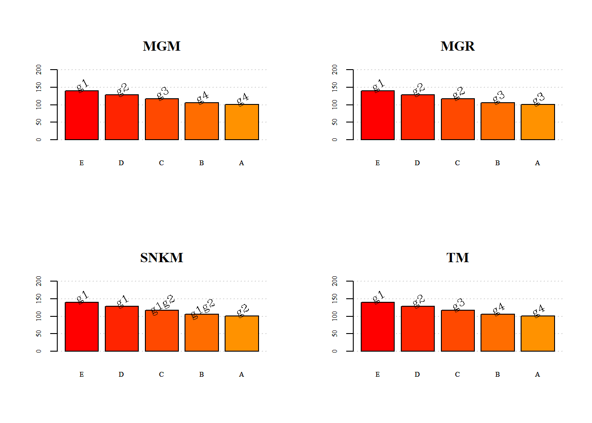

---
output:
  pdf_document: default
  html_document: default
---


# Pacotes

O pacote em R é um diretório de arquivos necessários para carregar um código de funções, dados, documentações de ajuda, testes, etc. O próprio R em sua instalação, contém 30 pacotes, que dizemos que são as funções mínimas para a utilização da linguagem. Nesse diretório não há apenas códigos em R, mas um pacote fonte (do inglês, source package), contendo os arquivos mencionados acima, ou um arquivo compactado, de extensão .tar.gz do pacote fonte, ou um pacote instalado, resultado da função R CMD INSTALL, que será visto no módulo Programação em R (Nível Avançado). Isso acontece no SO Linux. Para as plataformas Windows e Macintosh, existem também os pacotes binários ou compactados com a extensão .zip ou .tar.gz

Um pacote, portanto é a unidade básica para o compartilhamento de um código. Atualmente, até 11/03/2021, o número de pacotes disponíveis é 17.295, e isso no CRAN, isto é, na Comprehenive R Archive Network, o repositório oficial de pacotes no R. Qualquer usuário pode publicar um pacote e disponibilizá-lo sob o CRAN. Para isso, uma série de testes iniciais são realizados para verificar se não há problemas. Significa também se um pacote está disponível no CRAN ele funcionará nas três plataformas mais usadas em sistema operacional, SO Linux ou sitemas Unix, SO Windows e SO Macintosh. Há outros repositórios que podem ser disponibilizados os pacotes, como por exemplo, no GitHub. Porém, não há a garantia de que possa estar funcionando corretamento em seu sistema operacional, como os pacotes disponíveis no CRAN.

Para uma instalação mais rápida no CRAN, há espelhos disponíveis no Brasil, do qual o primeiro foi desenvolvido e está funcionando até hoje na UFPR.

Contudo, uma coisa deve ficar claro, que erroneamente, alguns usuários chamam pacote de biblioteca. Nas documentações do R, biblioteca é o diretório onde os pacotes são instalados, também chamados de diretório de biblioteca ou diretório de arvores. O outro sentido de biblioteca é o de biblioteca compartilhada (dinâmica ou estática), que armazenam código compilado que se vinculam aos pacotes, por exemplo, no Windows são as DLLs.

A estrutura básica de um pacote é apresentada na Figura 18.

$$FIGURA$$


Vejamos as ideias básicas desses subdiretórios e arquivos,

- **DESCRIPTION**: Esse é um arquivo de texto, contendo informações básicas como o título do pacote, versão, licença, descrição, nome dos autores, e o mantenedor do pacote, isto é, para quando um pacote estiver com problema ou o CRAN entre em contato, será para este último. Esses as informações obrigatórias que devem ter nesse arquivo.
- **NAMESPACE**: Esse arquivo embora tenha tenha muita semelhança com a linguagem R, o seu conteúdo, se destina a importação e exportação de funções no pacote. Será nesse arquivo, que diremos quais os pacotes que ele depende, isto é, as funções, e quais as funções exportadas, visíveis, que devem ser apresentadas aos usuários.
- **R/**: Esse subdiretório apresenta os scripts com as funções em R. é o cérebro do pacote.
- **man/**: Esse subdiretório apresenta os arquivos de ajuda, com extensão .Rd. Isso significa, que uma vez instalado o pacote no R, o acesso aos manuais de ajuda do referido pacote, estarão disponíveis, graças a esses arquivos.

## Instalação de um pacote

A instalação de um pacote via CRAN pode ser feito pela função install.packages(pkgs = "nome_pacote"). Por exemplo, vamos tentar instalar o pacote midrangeMCP, da seguinte forma:

``` r
install.packages("midrangeMCP")
```
Pode ser que nesse processo, dependendo de onde o usuário esteja executando essa linha de comando, interface do R ou RStudio, que seja solicitado o espelho por onde deseja fazer a instalação. Isso é apenas um atalho para ter um acesso mais rápido na instalação do pacote. A sugestão é escolher um espelho de seu país de origem.

Uma forma simples de se ter detalhes do pacote na internet, tais como, baixar o pacote fonte ou o pacote binário do midrangeMCP, por exemplo, é sempre usar essa url: http://cran.r-project.org/package=midrangeMCP. Para qualquer outro pacote, basta mudar o nome do pacote na url, e assim, estaremos na página do repositório do pacote. O pacote fonte, como falado anteriormente, é compactado com extensão .tar.gz, no caso, midrangeMCP_3.1.1.tar.gz. O pacote binário tem a compactação zipada, midrangeMCP_3.1.1.tar.zip para o Windows e midrangeMCP_3.1.1.tgz para o Macintosh. O acesso aos arquivos do pacote mencionados no esqueleto são disponíveis no pacote fonte.

Uma outra forma possível de instalação é baixar o arquivo do pacote fonte para o seu computador e instalá-lo,

``` r
install.packages(pkgs = "./midrangeMCP.tar.gz", repos = NULL, type = "source")
```
Consideramos que o arquivo do pacote esteja no diretório de trabalho do usuário. Caso contrário, deve ser informado o local onde pacote se encontra no computador. Para o Window ou Macintosh, é possível instalar também, a partir dos pacotes binários.

Muitos dos desenvolvedores, estão disponibilizando seus projetos de pacotes, principalmente no GitHub, inclusive com manuals de ajuda com maiores detalhes. Pode ser possível instalar esses pacotes por esse repositório. Precisamos inicialmente do pacote devtools, e posteriormente a instalação do pacote. Segue,

``` r
install.packages("devtools")
install_github("bendeivide/midrangeMCP")
```
Contudo, devemos dar a preferência pela instalação via CRAN. Por lá, teremos a garantia que os pacotes estão estáveis para a utilização nas referidas plataformas mencionadas acima.

Alguns pacotes, por falta de manutenção, seja por atualizações do R ou por qualquer outro motivo, podem se tornar incompatíveis para utilização sobre alguns dos três sistemas operacionais básicos (SO Windows, Unix e SO Mac) exigidos pelo R. Dessa forma, se as correções não forem feitas, estes pacotes e tornam órfãos, ou seja, desativados sob o CRAN. O primeiros pacotes sob o CRAN, por exemplo, não tinham o arquivo NAMESPACE, que hoje é exigido. Qualquer tentativa de instalação desses pacotes nessas situações, não serão bem sucedidas. Dessa forma, fizemos uma vídeo-aula, como tentativa de recuperar os pacotes desativados. Porém, deixemos claro que nem sempre é possível a instalação de pacotes desativados.


## Objetivos de um pacote

A ideia de um pacote para um usuário R deve representar como uma ferramenta para otimizar suas atividades do dia-a-dia na utilização da linguagem. Suponha que o usuário seja um cientista de dados, e todos os dias ele carrega uma sequência de scripts, via source, para disponibilizar suas funções no ambiente global. Isso acaba gerando processos repetitivos de trabalho desnecessários.

Ao invés, o cientista de dados pode desenvolver um pacote, e esse pacote conter todas as funções necessárias para as suas análises. De uma vez, o pacote instalado e anexado no caminho de busca, todas as suas funções estarão disponíveis para utilização. Portanto, o entendimento disso, permite uma maior eficiência de trabalho.

Outro ponto é que a experiência contida em um pacote pode ser propagada mais facilmente para outros usuários, mostrando que o conhecimento é uma liberdade necessária. Tanto pelo CRAN, quanto por outras plataformas, o pacote pode ser disponibilizado.

## Utilizando funções de um pacote

Uma vez instalado o pacote, precisamos carregar e anexá-lo, para que possamos utilizar os recursos disponíveis no pacote, como funções, dados, etc. Isso significa, disponibilizar na memória e inseri-lo no caminho de busca, respectivamente. Para fazer essas duas ações ao mesmo tempo, use a função library() ou require(). A primeira função se for utilizada sem argumento algum, retorna todos os pacotes instalados na bibioteca de pacotes do R. Vejamos o exemplo do pacote midrangeMCP,


```r
# Carregando e anexando o pacote midrangeMCP
library(midrangeMCP)

# Usando a função MRtest() desse pacote
#-----
# Dados simulados de um experimento em DIC (Delineamento Inteiramente Casualizado)

# Variavel resposta
rv <- c(100.08, 105.66, 97.64, 100.11, 102.60, 121.29, 100.80,
        99.11, 104.43, 122.18, 119.49, 124.37, 123.19, 134.16,
        125.67, 128.88, 148.07, 134.27, 151.53, 127.31)

# Tratamento
treat <- factor(rep(LETTERS[1:5], each = 4))

# Anava
res     <- anova(aov(rv~treat))
DFerror <- res$Df[2]
MSerror <- res$`Mean Sq`[2]

# Aplicando testes
results <- midrangeMCP::MRtest(y = rv,
                  trt = treat,
                  dferror = DFerror,
                  mserror = MSerror,
                  alpha = 0.05,
                  main = "PCMs",
                  MCP = c("all"))
```

```
## MCP's based on distributions of the studentized midrange and range
## 
## Study:  PCMs 
## 
## Summary:
##    Means   std r    Min    Max
## A 100.87  3.40 4  97.64 105.66
## B 105.95 10.33 4  99.11 121.29
## C 117.62  9.02 4 104.43 124.37
## D 127.97  4.74 4 123.19 134.16
## E 140.30 11.42 4 127.31 151.53
## 
##  Mean Grouping Midrange Test
## 
## Statistics: 
##   Exp.Mean      CV  MSerror Df n Stud.Midrange Ext.DMS  Int.DMS
##    118.542 7.08182 70.47488 15 5      1.089968 5.90246 4.575105
## 
## Groups: 
##    Means Groups
## E 140.30     g1
## D 127.97     g2
## C 117.62     g3
## B 105.95     g4
## A 100.87     g4
## 
## Mean Grouping Range Test
## 
## Statistics: 
##   Exp.Mean      CV  MSerror Df n Stud.Range      DMS
##    118.542 7.08182 70.47488 15 5   4.366985 18.33027
## 
## Groups: 
##    Means Groups
## E 140.30     g1
## D 127.97     g2
## C 117.62     g2
## B 105.95     g3
## A 100.87     g3
## 
## SNK Midrange Test
## 
## Statistics: 
##       Exp.Mean     CV MSerror Df n Stud.Midrange    DMS
## comp1  118.542 7.0818 70.4749 15 5        1.0900 5.9025
## comp2  118.542 7.0818 70.4749 15 4        1.1646 6.2159
## comp3  118.542 7.0818 70.4749 15 3        1.2828 6.7121
## comp4  118.542 7.0818 70.4749 15 2        1.5072 7.6536
## 
## Groups: 
##    Means Groups
## E 140.30     g1
## D 127.97     g1
## C 117.62   g1g2
## B 105.95   g1g2
## A 100.87     g2
## 
## Tukey Midrange Test
## 
## Statistics: 
##   Exp.Mean      CV  MSerror Df n Stud.Midrange Ext.DMS  Int.DMS
##    118.542 7.08182 70.47488 15 5      1.089968 5.90246 4.575105
## 
## Groups: 
##    Means Groups
## E 140.30     g1
## D 127.97     g2
## C 117.62     g3
## B 105.95     g4
## A 100.87     g4
```


```r
midrangeMCP::MRbarplot(results)
```



$$FIGURA$$

## Carregando e anexando um pacote

Anteriormente, falamos que usamos a função library() ou require() para carregar e anexar um pacote para utilizar suas funções, após a instalação. Carregar um pacote significa disponibilizar na memória ativa. Para acessar uma função de um pacote após ter sido carregado, usamos o operador ::, isto é, nome_pacote::nome_função. Isto significa, que será chamado a função necessária sem anexar o pacote no caminho de busca. Estudaremos a seguir um pouco mais sobre caminho de busca. Para esse momento, entenda que é um caminho hierarquizado de ambientes, isto é, objetos que armazenam, em forma de lista, nomes associados a objetos. A função para ver o caminho de busca é search(). Em nosso caso, temos:


```r
# Caminho de busca
search()
```

```
##  [1] ".GlobalEnv"          "package:midrangeMCP" "package:stats"      
##  [4] "package:graphics"    "package:grDevices"   "package:utils"      
##  [7] "package:datasets"    "package:methods"     "Autoloads"          
## [10] "package:base"
```


```r
# Carregando e chamando uma função de um pacote
midrangeMCP::MRwrite(results, extension = "latex")
```

```
## Table in latex of results of the MGM test
## 
## % latex table generated in R 4.0.3 by xtable 1.8-4 package
## % Wed Aug 18 08:51:31 2021
## \begin{table}[ht]
## \centering
## \begin{tabular}{lrl}
##   \hline
## trt & Means & Groups \\ 
##   \hline
## E & 140.30 & g1 \\ 
##   D & 127.97 & g2 \\ 
##   C & 117.62 & g3 \\ 
##   B & 105.95 & g4 \\ 
##   A & 100.87 & g4 \\ 
##    \hline
## \end{tabular}
## \end{table}
## 
## 
## Table in latex of results of the MGR test
## 
## % latex table generated in R 4.0.3 by xtable 1.8-4 package
## % Wed Aug 18 08:51:31 2021
## \begin{table}[ht]
## \centering
## \begin{tabular}{lrl}
##   \hline
## trt & Means & Groups \\ 
##   \hline
## E & 140.30 & g1 \\ 
##   D & 127.97 & g2 \\ 
##   C & 117.62 & g2 \\ 
##   B & 105.95 & g3 \\ 
##   A & 100.87 & g3 \\ 
##    \hline
## \end{tabular}
## \end{table}
## 
## 
## Table in latex of results of the SNKM test
## 
## % latex table generated in R 4.0.3 by xtable 1.8-4 package
## % Wed Aug 18 08:51:31 2021
## \begin{table}[ht]
## \centering
## \begin{tabular}{lrl}
##   \hline
## trt & Means & Groups \\ 
##   \hline
## E & 140.30 & g1 \\ 
##   D & 127.97 & g1 \\ 
##   C & 117.62 & g1g2 \\ 
##   B & 105.95 & g1g2 \\ 
##   A & 100.87 & g2 \\ 
##    \hline
## \end{tabular}
## \end{table}
## 
## 
## Table in latex of results of the TM test
## 
## % latex table generated in R 4.0.3 by xtable 1.8-4 package
## % Wed Aug 18 08:51:31 2021
## \begin{table}[ht]
## \centering
## \begin{tabular}{lrl}
##   \hline
## trt & Means & Groups \\ 
##   \hline
## E & 140.30 & g1 \\ 
##   D & 127.97 & g2 \\ 
##   C & 117.62 & g3 \\ 
##   B & 105.95 & g4 \\ 
##   A & 100.87 & g4 \\ 
##    \hline
## \end{tabular}
## \end{table}
## 
## See yours tables in Console
##  Format: latex
```

```
## $`Result of tests`
## $`Result of tests`$group.MGM
## % latex table generated in R 4.0.3 by xtable 1.8-4 package
## % Wed Aug 18 08:51:31 2021
## \begin{table}[ht]
## \centering
## \begin{tabular}{rlrl}
##   \hline
##  & trt & Means & Groups \\ 
##   \hline
## 1 & E & 140.30 & g1 \\ 
##   2 & D & 127.97 & g2 \\ 
##   3 & C & 117.62 & g3 \\ 
##   4 & B & 105.95 & g4 \\ 
##   5 & A & 100.87 & g4 \\ 
##    \hline
## \end{tabular}
## \end{table}
## 
## $`Result of tests`$group.MGR
## % latex table generated in R 4.0.3 by xtable 1.8-4 package
## % Wed Aug 18 08:51:31 2021
## \begin{table}[ht]
## \centering
## \begin{tabular}{rlrl}
##   \hline
##  & trt & Means & Groups \\ 
##   \hline
## 1 & E & 140.30 & g1 \\ 
##   2 & D & 127.97 & g2 \\ 
##   3 & C & 117.62 & g2 \\ 
##   4 & B & 105.95 & g3 \\ 
##   5 & A & 100.87 & g3 \\ 
##    \hline
## \end{tabular}
## \end{table}
## 
## $`Result of tests`$group.SNKM
## % latex table generated in R 4.0.3 by xtable 1.8-4 package
## % Wed Aug 18 08:51:31 2021
## \begin{table}[ht]
## \centering
## \begin{tabular}{rlrl}
##   \hline
##  & trt & Means & Groups \\ 
##   \hline
## 1 & E & 140.30 & g1 \\ 
##   2 & D & 127.97 & g1 \\ 
##   3 & C & 117.62 & g1g2 \\ 
##   4 & B & 105.95 & g1g2 \\ 
##   5 & A & 100.87 & g2 \\ 
##    \hline
## \end{tabular}
## \end{table}
## 
## $`Result of tests`$group.TM
## % latex table generated in R 4.0.3 by xtable 1.8-4 package
## % Wed Aug 18 08:51:31 2021
## \begin{table}[ht]
## \centering
## \begin{tabular}{rlrl}
##   \hline
##  & trt & Means & Groups \\ 
##   \hline
## 1 & E & 140.30 & g1 \\ 
##   2 & D & 127.97 & g2 \\ 
##   3 & C & 117.62 & g3 \\ 
##   4 & B & 105.95 & g4 \\ 
##   5 & A & 100.87 & g4 \\ 
##    \hline
## \end{tabular}
## \end{table}
## 
## 
## $`Descriptive Statistics`
## % latex table generated in R 4.0.3 by xtable 1.8-4 package
## % Wed Aug 18 08:51:31 2021
## \begin{table}[ht]
## \centering
## \begin{tabular}{rlrrrrr}
##   \hline
##  & trt & Means & std & r & Min & Max \\ 
##   \hline
## 1 & A & 100.87 & 3.40 & 4.00 & 97.64 & 105.66 \\ 
##   2 & B & 105.95 & 10.33 & 4.00 & 99.11 & 121.29 \\ 
##   3 & C & 117.62 & 9.02 & 4.00 & 104.43 & 124.37 \\ 
##   4 & D & 127.97 & 4.74 & 4.00 & 123.19 & 134.16 \\ 
##   5 & E & 140.30 & 11.42 & 4.00 & 127.31 & 151.53 \\ 
##    \hline
## \end{tabular}
## \end{table}
```


```r
# Verificando novamente o caminho de busca
search()
```

```
##  [1] ".GlobalEnv"          "package:midrangeMCP" "package:stats"      
##  [4] "package:graphics"    "package:grDevices"   "package:utils"      
##  [7] "package:datasets"    "package:methods"     "Autoloads"          
## [10] "package:base"
```

Com as linhas de comando apresentadas anteriormente, percebemos ao executar a função MRwrite() do pacote midrangeMCP, usando :: que o caminho de busca não foi alterado. Isso significa que o pacote não foi anexado, apenas carregado, ou seja, se o usuário desejar usar alguma função do pacote midrangeMCP digitando apenas o nome no console, não será possível, porque o pacote não está anexado ao caminho de busca.

Vejamos uma outra situação,


```r
# Caminho de busca
search()
```

```
##  [1] ".GlobalEnv"          "package:midrangeMCP" "package:stats"      
##  [4] "package:graphics"    "package:grDevices"   "package:utils"      
##  [7] "package:datasets"    "package:methods"     "Autoloads"          
## [10] "package:base"
```


```r
# Carregando e anexando um pacote
library(midrangeMCP)

# Verificando novamente o caminho de busca
search()
```

```
##  [1] ".GlobalEnv"          "package:midrangeMCP" "package:stats"      
##  [4] "package:graphics"    "package:grDevices"   "package:utils"      
##  [7] "package:datasets"    "package:methods"     "Autoloads"          
## [10] "package:base"
```


```r
# Chamando uma funcao do pacote
# guimidrangeMCP()
```

Com o uso da função library(), percebemos que o caminho de busca foi alterado, porque agora temos o ambiente de pacote package:midrangeMCP. Isso significa que agora poderemos acessar os objetos desse pacote apenas digitando o nome associado a eles. Por fim, a última linha foi comentada, porque é uma interface gráfica ao usuário para o pacote, o que chamamos de GUI (do inglês, Graphical User Interface), mas que pode ser visualizado na Figura 19.

$$FIGURA$$


## *NAMESPACE* de um pacote

No início da seção sobre pacotes, falamos sobre o esqueleto de um pacote, isto é, os componentes básicos de um pacote. Um dos arquivos é o NAMESPACE. Esse arquivo é respondsável pela exportação e importação de funções. As funções exportadas de um pacote, por meio desse arquivo, são aquelas visíveis após a anexação do pacote ao caminho de busca, ou por meio do operador ::. As funções importadas são aquelas utilizadas de outros pacotes.

As funções ditas internas do pacote, são aquelas não mencionadas no NAMESPACE. Em muitas situações, precisamos de funções internas necessárias para a finalidade do pacote, que muitas vezes não é objetivo final para disponibilidade dos usuários, mas códigos intermediários para a boa funcionabilidade do pacote. Dessa forma, uma boa escolha para que não haja conflitos em nomes associados a objetos no ambiente de trabalho, é a decisão de não exportá-los.

Porém, quando se cria um pacote, por exemplo, pelo RStudio, o padrão no NAMESPACE é o comando:

exportPattern("^[^\\.]")

que significa que todas as funções no pacote serão exportadas que não iniciam por um ponto (“.”). Como toda função em um pacote precisa de um arquivo de ajuda (.Rd), todas as funções deverão ter esses tipos arquivos inseridos no subdiretório man/.

Os primeiros pacotes submetidos ao CRAN na primeiras versões do R, não tinha o arquivo NAMESPACE. Por isso que quando tentamos instalar pacotes órfãs antigos, um dos erros é a falta desse arquivo.

Mais detalhes sobre o desenvolvimento de pacotes será abordado no módulo Programação em R (Nível Avançado)

## Usando os operadores `::` e `:::`

Como falamos anteriormente, para chamarmos uma função sem a necessidade de anexar o pacote, usamos o operador ::. Comentamos também, que algumas funções não eram exportadas pelo NAMESPACE de um pacote. Contudo, se desejarmos visualizar ou executá-las, poderemos utilizar o operador :::. Vejamos um exemplo,


```r
# Instale o pacote SMR
# install.packages(SMR) # Descomente a linha de comando para instalar
# Carregando e chamando funcoes exportadas do pacote SMR
SMR::pSMR(q = 2, size = 10, df = 3)
```

```
## [1] 0.9905216
```


```r
# Carregando e chamando funcoes nao exportadas ao pacote
SMR:::GaussLegendre(size = 4)
```

```
## $nodes
## [1] -0.8611363 -0.3399810  0.3399810  0.8611363
## 
## $weights
## [1] 0.3478548 0.6521452 0.6521452 0.3478548
```

As funções internas dos pacotes devem ser utilizadas com muita cautela, uma vez que são funções que podem passar por atualizações, mudanças. Isso porque, como não são funções exportadas, alguns pacotes podem passar por atualizações, e desse modo, estas funções também podem ser atualizadas ou até mesmo alteradas.

Outro ponto interessante é que não se recomenda a utilização de importação de funções internas de outros pacotes no desenvolvimento de pacotes, uma vez que são funções que podem passar por mudanças drásticas, e portanto, gerar problemas nas rotinas. Se uma função em um pacote não foi exportada, é porque o desenvolvedor tem um bom motivo para tal situação. As funções exportadas são de fato a essência do objetivo de um pacote, e por isso que elas são exportadas.
