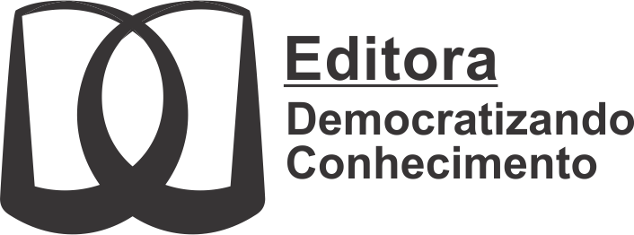

--- 
title: "Estudando o Ambiente R"
author: "Ben Dêivide, Diego Arthur"
date: "`r Sys.Date()`"
site: bookdown::bookdown_site

bibliography:
- book.bib
- packages.bib
biblio-style: apalike
link-citations: yes

url: 'https://bendeivide.github.io/book-eambr/'
github-repo: bendeivide/book-eambr

---
# Bem-vindo {-}

 Esse é um *livro digital* da 1ª edição do __"[Estudando o ambiente R]()"__, um livro com o selo Democratizando Conhecimento (DC). O Livro é destinado aos usuários `R` que objetivam aprofundar no entendimento do ambiente R para seus projetos pessoais e profissionais.

O número de leitores  que acessaram esse livro:
 

 <small><a href='https://www.free-website-hit-counter.com' title="Free Website Hit Counter">Free website hit counter</a></small>

## Licença {-}

 Este trabalho está licenciado com uma Licença <a rel="license" href="http://creativecommons.org/licenses/by-nc/4.0/">Creative Commons - Atribuição-NãoComercial 4.0 Internacional</a>.

# Epígrafe {-}

*A melhor linguagem é a que você domina!* (Ben Dêivide)
